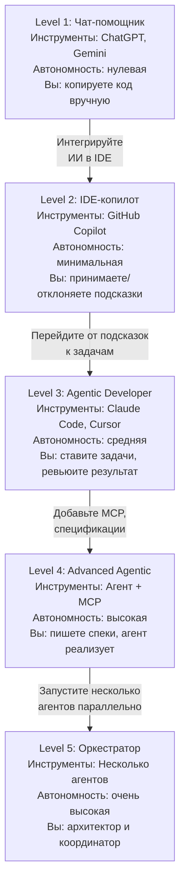

# 5 уровней зрелости использования ИИ

Каждый уровень — качественный скачок в способе взаимодействия с ИИ. Не "больше использую", а "по-другому использую". Переход требует новых навыков, не только инструментов.

**Где вы сейчас?** Оцените себя по матрице навыков в конце модуля. Средний балл по 6 навыкам покажет ваш текущий уровень.
