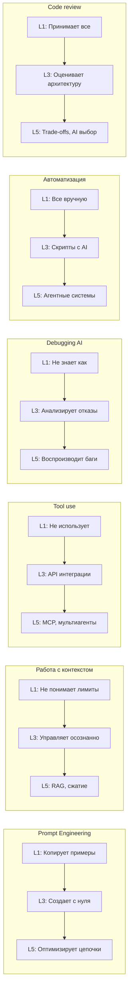

[← Оглавление](../../../README.md)

# Навыки по уровням: от Level 1 к Level 5

Шесть ключевых навыков, каждый из которых развивается от базового к продвинутому. Ваш уровень определяется не максимальным навыком, а средним баллом. Разброс > 2 уровней между навыками = нужно выровнять слабые зоны.

**Как пользоваться:** оцените себя по каждому навыку (1-5). Средний балл = ваш уровень зрелости. Разброс > 2 = нужно подтянуть отстающие навыки перед переходом на следующий уровень.
