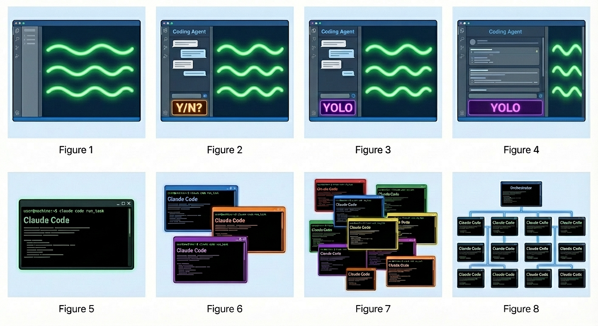

# 8 уровней эволюции агентной разработки по Стиву Йегге

> Альтернативная модель уровней зрелости от [Steve Yegge](https://steve-yegge.medium.com/the-future-of-coding-agents-e9451a84207c) — инженера с 40+ летним опытом (GeoWorks, Amazon, Google, Grab), автора open-source оркестратора [Gas Town](https://github.com/nicholasgasior/gstown).

В отличие от нашей 5-уровневой модели (→ [theory.md](./theory.md)), модель Йегге фокусируется не на навыках разработчика, а на **инструментальном прогрессе** — как меняется интерфейс взаимодействия с ИИ и степень автономности агента.

---

## Уровни 1–4: Работа в IDE

### Уровень 1: Почти без ИИ

Автодополнение кода, иногда вопросы в чат. ИИ — это фоновый инструмент, а не осознанная часть процесса.

**Соответствие нашей модели:** Уровень 1 (чат-помощник) + начало Уровня 2 (копилот).

### Уровень 2: Агент в IDE с подтверждениями

Узкий агент в сайдбаре IDE. Может запускать инструменты (чтение файлов, терминал), но спрашивает разрешение на каждое действие. Разработчик контролирует каждый шаг.

**Соответствие нашей модели:** Уровень 2 → начало Уровня 3. Появляется агентность, но с полным human-in-the-loop.

### Уровень 3: Агент в IDE, YOLO-режим

Доверие растёт — разработчик отключает запросы разрешений. Агент выполняет действия без подтверждения. Скорость возрастает, но растёт и риск.

**Соответствие нашей модели:** Уровень 3 (Agentic developer). Осознанное делегирование с выборочным контролем.

### Уровень 4: Широкий агент в IDE

Агент занимает весь экран. Код нужен только для просмотра диффов. Разработчик ставит задачи, агент реализует. IDE превращается из редактора кода в интерфейс управления агентом.

**Соответствие нашей модели:** Уровень 3 → Уровень 4. Агент работает автономно на уровне фичи.

---

## Уровни 5–6: CLI и параллельность

### Уровень 5: CLI с одним агентом

Переход из IDE в терминал. Агент запускается как `claude code run_task`. Диффы пролетают в терминале — разработчик может смотреть на них, а может и нет. Полное доверие агенту в рамках задачи.

**Соответствие нашей модели:** Уровень 4 (продвинутый Agentic developer). CLI даёт больше гибкости чем IDE — скрипты, пайплайны, MCP.

### Уровень 6: CLI с несколькими агентами

3–5 параллельных экземпляров агента. Каждый работает в своём worktree или контейнере. Разработчик распределяет задачи между ними и собирает результаты. Скорость разработки кратно возрастает.

**Соответствие нашей модели:** Уровень 5 (оркестратор). Начало параллельной работы.

---

## Уровни 7–8: Оркестрация

### Уровень 7: 10+ агентов, ручное управление

Разработчик управляет десятком агентов вручную. Появляются проблемы координации: конфликты в коде, потеря контекста, сложность мониторинга. Ручное управление достигает предела.

**Соответствие нашей модели:** Уровень 5 на пределе. Нужна автоматизация.

### Уровень 8: Собственный оркестратор

Разработчик строит свою систему оркестрации: автоматическое распределение задач, мониторинг прогресса, сборка результатов, разрешение конфликтов. Примеры: Gas Town, Enji Fleet, кастомные скрипты поверх Claude Code.

**Соответствие нашей модели:** За пределами Уровня 5 — то, что мы описываем в разделе "Путь дальше".

---

## Сравнение моделей

| Йегге (8 уровней) | Наша модель (5 уровней) | Ключевое отличие |
|---|---|---|
| 1. Почти без ИИ | 1–2. Чат + Копилот | Йегге объединяет в один уровень |
| 2. Агент с подтверждениями | 2–3. Копилот → Agentic | У нас акцент на навыках, у Йегге на UI |
| 3. YOLO-режим | 3. Agentic developer | Совпадают |
| 4. Широкий агент | 3–4. Agentic → Продвинутый | Йегге выделяет смену интерфейса |
| 5. CLI одиночный | 4. Продвинутый Agentic | Совпадают |
| 6. CLI мульти-агент | 5. Оркестратор (начало) | Совпадают |
| 7. 10+ агентов вручную | 5. Оркестратор | Йегге разделяет ручной и автоматический этапы |
| 8. Свой оркестратор | За Уровнем 5 | Йегге детализирует "путь дальше" |

**Главное различие:** наша модель описывает **компетенции разработчика** (промптинг, надзор, автоматизация), а модель Йегге — **эволюцию инструмента** (UI → CLI → параллельность → оркестрация). Обе модели дополняют друг друга: навыки определяют, какой инструмент вы можете эффективно использовать.
