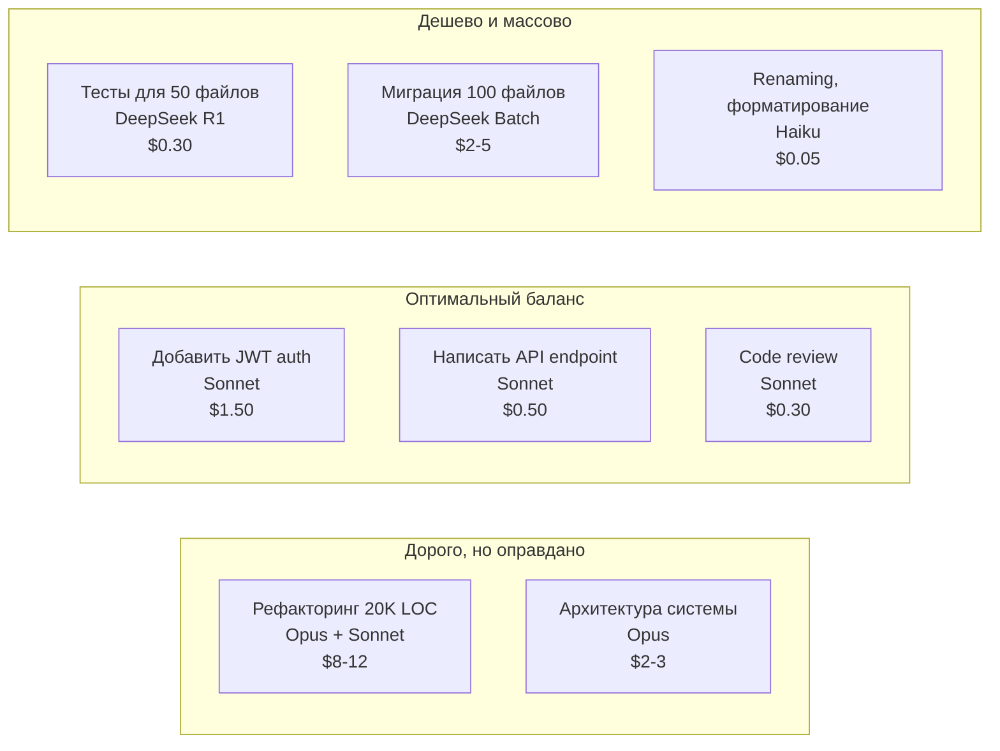

[← Оглавление](../../../README.md)

# Оптимизация стоимости: модель под задачу

Реальные примеры стоимости типичных задач с разными комбинациями инструмент + модель. Правильный выбор экономит деньги без потери качества.

**Правила экономии:**
1. **Планирование** (10% задач): Opus — дорого, но окупается точностью плана
2. **Реализация** (60% задач): Sonnet — золотая середина
3. **Boilerplate** (30% задач): Haiku/DeepSeek — дешево и достаточно
4. **Никогда**: Haiku на проектирование архитектуры — дешёвые модели не справляются со сложными задачами

> [!WARNING]
> Дешёвая модель на архитектурном планировании сэкономит $1-2, но обойдётся в десятки часов переделок. Opus/GPT-5 Pro на планирование — всегда окупается.
