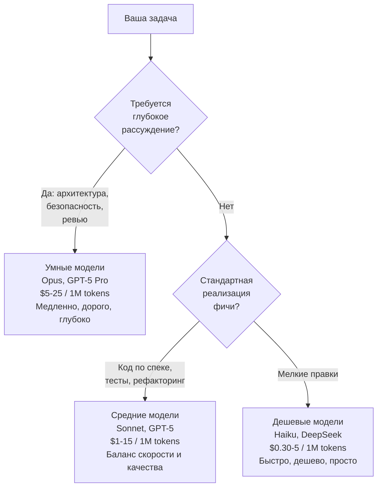

[← Оглавление](../../../README.md)

# Три категории моделей

Не "какая модель лучше", а "какая модель для какой роли". Умные модели планируют, средние реализуют, дешевые — массовая работа.

**Мульти-модельная стратегия экономит 50-80%:**
- Opus планирует архитектуру (10% задач, 40% бюджета)
- Sonnet реализует фичи (60% задач, 50% бюджета)
- Haiku/DeepSeek делает boilerplate (30% задач, 10% бюджета)
