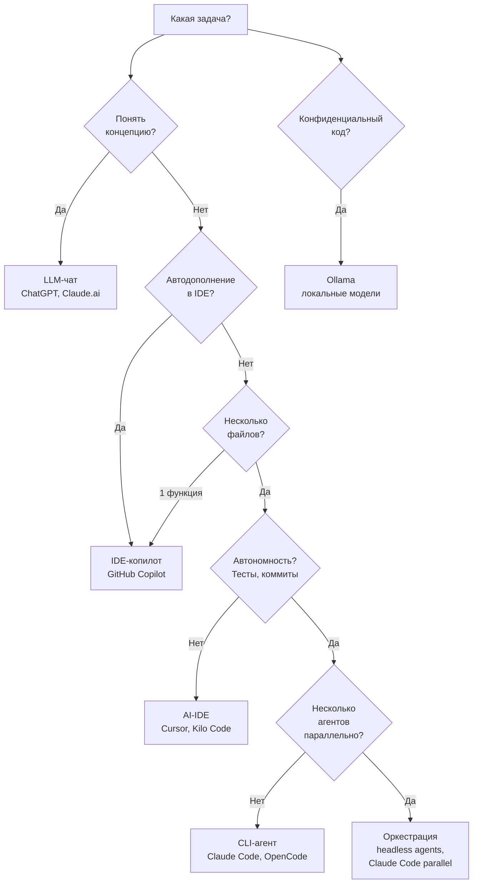

# Выбор инструмента по задаче

Дерево решений: какой инструмент использовать в зависимости от типа задачи. Не "какой инструмент лучше", а "какой инструмент для какой задачи".

**Ключевой принцип:** задача определяет инструмент. Не наоборот.