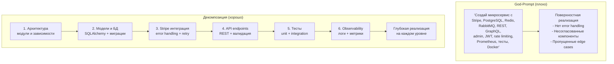

# Антипаттерн: God-Prompt vs Декомпозиция

God-Prompt — попытка описать все в одном промпте. Результат: поверхностная реализация, пропущенные детали, несогласованность между компонентами.

**Правило:** если промпт длиннее 10-15 строк — скорее всего, это God-Prompt. Разбейте на шаги. Каждый шаг = одна ответственность.
