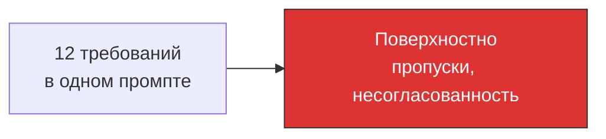
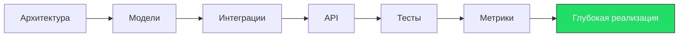

# Антипаттерн: God-Prompt vs Декомпозиция

God-Prompt — попытка описать всё в одном промпте.

Декомпозиция — каждый шаг решает одну задачу на нужной глубине.

**Правило:** если промпт длиннее 10-15 строк — скорее всего, это God-Prompt. Разбейте на шаги.
