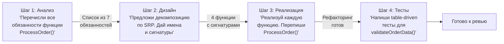

# Prompt Chaining: цепочка промптов

Вместо одного "god-prompt" на 20 строк — управляемая цепочка: выход каждого шага становится входом следующего. Между шагами — ваша точка контроля.

**Почему это лучше одного промпта:**
- На каждом шаге можно скорректировать направление
- Каждый шаг фокусируется на одной задаче — качество выше
- Если шаг 2 дал плохой результат, не нужно переделывать всё — только шаг 2
- Сложные задачи требуют: понять -> спланировать -> реализовать -> протестировать
