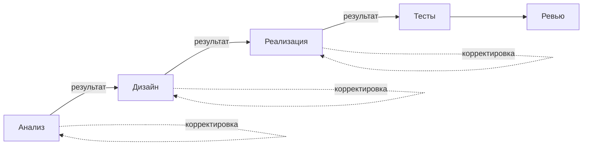
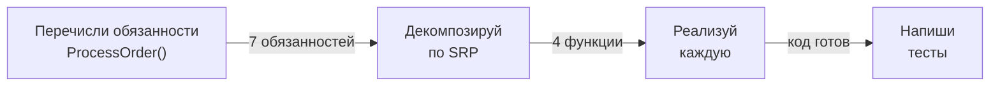

# Prompt Chaining: цепочка промптов

Вместо одного "god-prompt" — управляемая цепочка. Между шагами — ваша точка контроля.

Конкретный пример — рефакторинг функции ProcessOrder():

**Почему это лучше одного промпта:**
- На каждом шаге можно скорректировать направление
- Каждый шаг фокусируется на одной задаче — качество выше
- Если шаг дал плохой результат — переделайте только его
- Сложные задачи требуют: понять → спланировать → реализовать → протестировать
