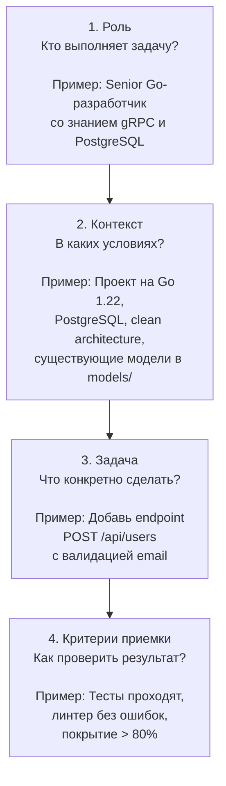

# Структура промпта: 4 блока

Эффективный промпт состоит из четырех блоков. Каждый следующий блок уточняет задачу. Пропуск блока снижает качество результата.

**Когда какой блок можно опустить:**
- **Роль** — для конкретных задач ("добавь endpoint /users") роль избыточна
- **Контекст** — если агент работает в IDE и видит проект, часть контекста он берет сам
- **Задача** — обязательна всегда
- **Критерии** — без них агент не знает, когда остановиться
