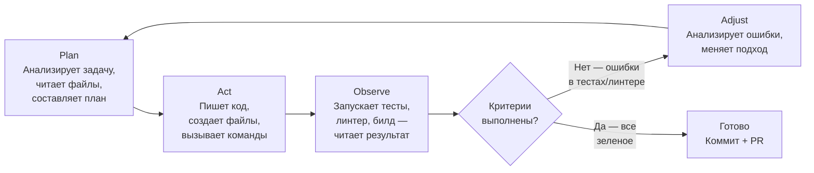

# Цикл работы агента (Agent Loop)

Агент работает итеративно, а не "сделал и все". Каждая итерация сужает разрыв между текущим состоянием кода и критериями приемки.

**Ключевой момент:** агент не останавливается после первой попытки. Он итерирует до тех пор, пока:
- Все критерии приемки выполнены (тесты зеленые, линтер молчит), **или**
- Достигнут лимит итераций — тогда агент сообщает о блокере
