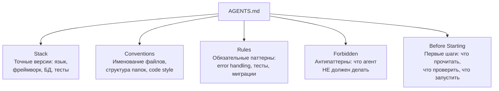

# Структура AGENTS.md

AGENTS.md — конституция проекта для агента. Каждая секция отвечает за свой аспект: что использовать, как писать код, что обязательно, что запрещено, с чего начать.

**Порядок важен:** агент читает AGENTS.md сверху вниз. Stack и Conventions задают контекст, Rules и Forbidden — ограничения, Before Starting — стартовый чеклист.
