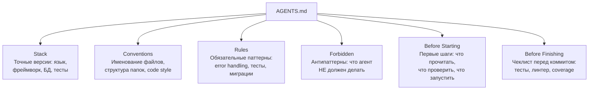

[← Оглавление](../../../README.md)

# Структура AGENTS.md

AGENTS.md — конституция проекта для агента. Это **главная точка входа**: агент читает AGENTS.md первым и ориентируется по нему во всём проекте.



**Порядок важен:** агент читает AGENTS.md сверху вниз. Stack и Conventions задают контекст, Rules и Forbidden — ограничения, Before Starting — стартовый чеклист, Before Finishing — финальная проверка.

> [!TIP]
> Если контекста много — раскидайте по файлам, в AGENTS.md оставьте ссылки. Пример:
> ```
> ## References
> - Стек и архитектура → docs/architecture.md
> - API-контракты → docs/api.md
> - ADR → docs/adr/
> ```
> AGENTS.md остаётся компактным и читаемым, а детали живут рядом с кодом.
