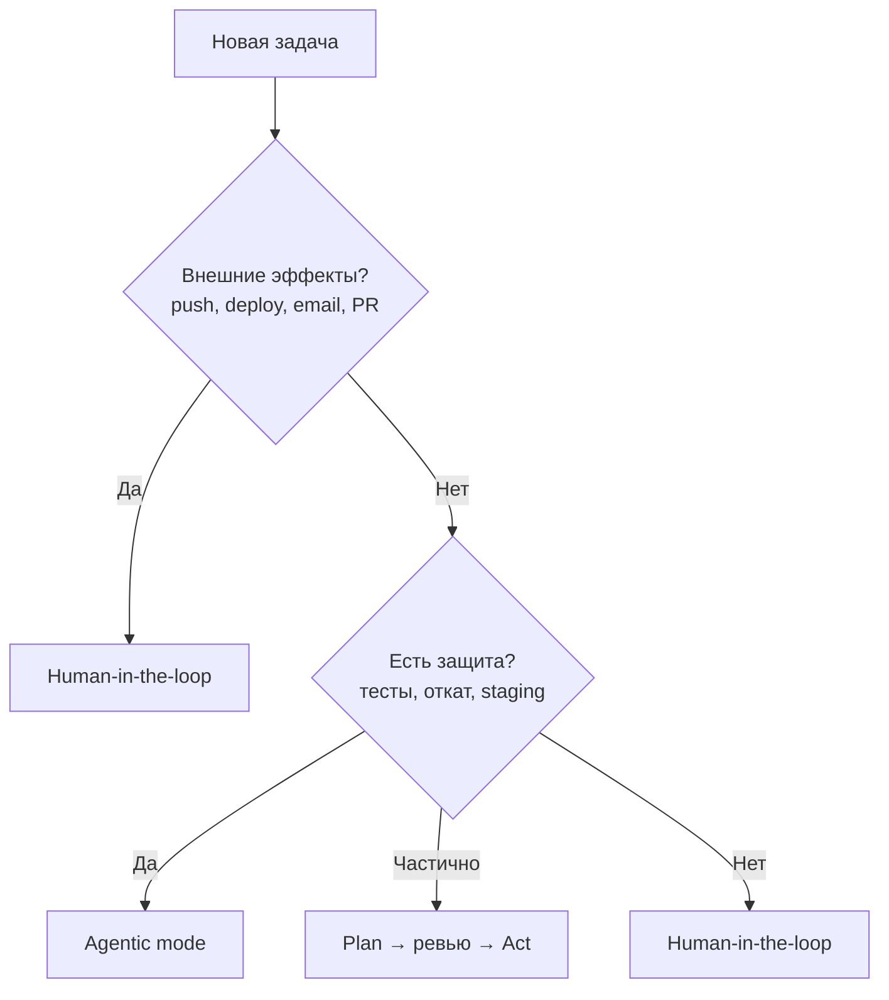

# Алгоритм выбора режима работы

Ключевой вопрос — не "есть ли риск", а "есть ли защита" (тесты, откат, staging).

```mermaid
flowchart TD
    Start[Новая задача] --> External{Внешние эффекты?<br/>push, deploy, email, PR}

    External -->|Да| HITL[Human-in-the-loop]

    External -->|Нет| Controls{Есть защита?<br/>тесты, откат, staging}

    Controls -->|Да| Agent[Agentic mode]
    Controls -->|Частично| Plan[Plan → ревью → Act]
    Controls -->|Нет| HITL2[Human-in-the-loop]
```
