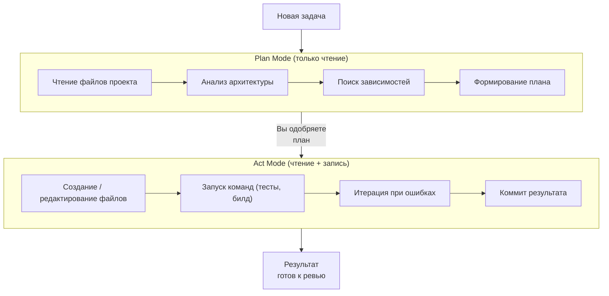

# Режимы работы: Plan vs Act

Два режима — это не просто фазы одной задачи, а разные уровни полномочий агента. В Plan-режиме агент только читает и анализирует. В Act-режиме — читает, пишет и исполняет.

**Зачем разделять:**
- **Plan** использует дорогую умную модель (Opus) — рассуждает, анализирует контекст
- **Act** может использовать дешевую модель (Sonnet, Haiku) — следует плану и пишет код
- Между режимами — ваша точка контроля: одобрить план или скорректировать
