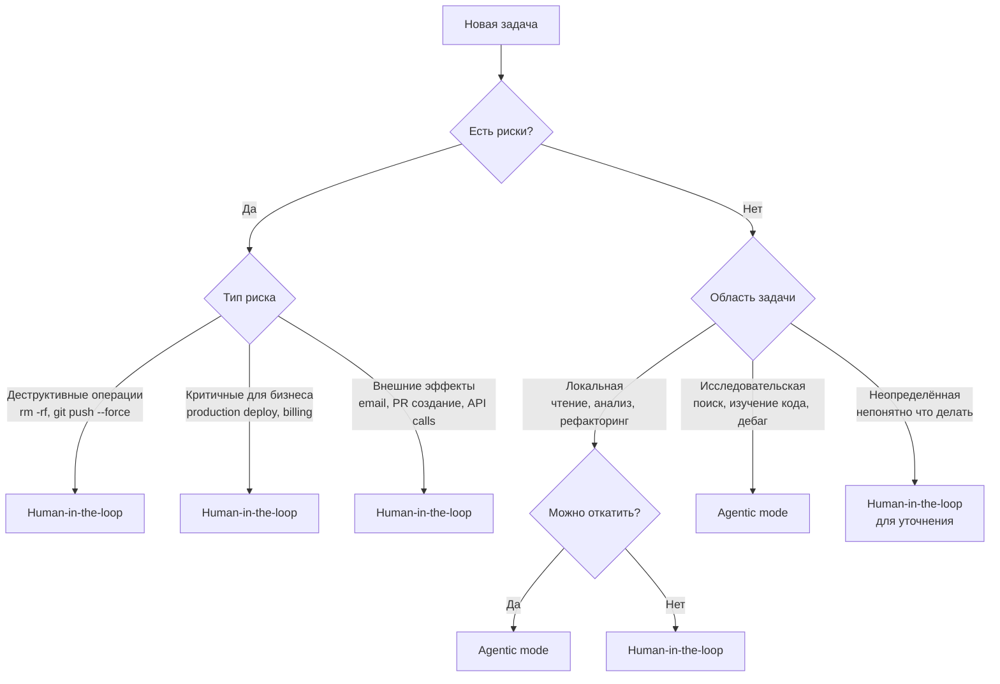

# Модуль 4: Работа с AI-агентом

## От консультанта к исполнителю

Главное различие между чатом и агентом не в модели, которая лежит в основе, а в способе взаимодействия и уровне автономности.

**Чат** работает в режиме вопрос-ответ. Вы спрашиваете: "Как реализовать JWT-авторизацию в FastAPI?" — получаете ответ с примером кода и объяснением. Код нужно скопировать, адаптировать к проекту, протестировать самостоятельно. Чат не имеет доступа к файлам проекта, не видит структуру кодовой базы, не может запустить тесты. Это справочная система с интерфейсом на естественном языке.

**Агент** работает в режиме постановки задачи. Вы формулируете задание: "Реализуй JWT-авторизацию для FastAPI с использованием модели User из models.py, создай эндпоинты /login и /refresh, добавь тесты с покрытием 80%+". Агент читает models.py, анализирует существующий код, пишет новые файлы, запускает тесты, итерирует при ошибках, и возвращает работающее решение. Это не консультант — это исполнитель.

Агент работает в цикле **plan → act → observe → adjust**. Он планирует последовательность действий, выполняет их (читает файлы, пишет код, запускает команды), наблюдает результат (вывод тестов, ошибки линтера), корректирует подход при необходимости. Этот цикл продолжается до выполнения критериев приёмки или достижения лимита итераций.

Полезная аналогия: **чат — это Stack Overflow с интерактивным интерфейсом**, агент — это **джуниор-разработчик**, которому вы ставите задачу в ticket tracker. Джуниору нужен контекст, чёткая постановка задачи, критерии приёмки, и ваша ответственность — проверить результат перед мержем в main. Эта ментальная модель помогает калибровать ожидания: не ждите от агента архитектурных прозрений, но рассчитывайте на выполнение рутинных задач с минимальным надзором.

## Постановка задачи: от проблемы к плану

Эффективная работа с агентом начинается с правильной декомпозиции задачи. Большие задачи агенты выполняют хуже, чем последовательность маленьких. Вместо "Добавь систему уведомлений в проект" эффективнее разбить на подзадачи: "Создай модель Notification в БД", "Реализуй сервис для отправки email через SendGrid", "Добавь API endpoint POST /notifications", "Напиши integration-тесты для endpoint". Каждая подзадача — атомарна, проверяема, имеет чёткие границы.

Контекст критичен. Агент не знает структуру проекта, архитектурные решения, code conventions — всё это нужно явно указать. Минимальный контекст для задачи: где лежат файлы, какие зависимости уже установлены, какие паттерны использовать (например, "все API endpoints используют async/await и FastAPI dependency injection"), какие ограничения учитывать ("не изменяй существующую схему БД, только добавляй новые таблицы").

Критерии приёмки превращают размытую задачу в проверяемую. Вместо "код должен работать" используйте конкретные критерии: 1) все тесты проходят (pytest без ошибок), 2) линтер чист (flake8, mypy), 3) покрытие тестами минимум 80% (coverage report), 4) API отвечает согласно OpenAPI-спецификации, 5) код следует PEP 8 и проектным conventions. Агент итерирует до выполнения этих критериев или явно сообщает, что не может выполнить (например, тест падает из-за отсутствующей зависимости, которую нужно обсудить).

**Агент-планировщик** — эффективный паттерн для сложных задач. Вместо того чтобы самостоятельно декомпозировать задачу на подзадачи, вы описываете проблему в общем виде, и агент в режиме планирования предлагает план: последовательность шагов, файлы, которые нужно создать или изменить, порядок выполнения. Вы ревьюите план, корректируете (например, "начни с тестов, потом реализация" или "используй существующий класс EmailService, не создавай новый"), и только после одобрения плана агент переходит к реализации. Это предотвращает ситуацию "агент ушёл не туда на 200 строк кода". Пример: "Проанализируй задачу: добавить rate limiting для API. Предложи план реализации с учётом стека (FastAPI, Redis). Какие файлы создать, какие изменить, в каком порядке." Агент предлагает план, вы комментируете, затем даёте команду "Реализуй этот план".

Интеграция проверки качества в постановку задачи, а не в отдельный этап после, значительно повышает результат. Вместо "Реализуй функцию, потом я скажу запустить тесты" используйте "Реализуй функцию, покрой unit-тестами, убедись что pytest проходит, запусти mypy для проверки типов". Агент сразу настраивается на итеративную разработку с самопроверкой. Это особенно эффективно с TDD-подходом: "Сначала напиши тесты для функции parse_url согласно спецификации, затем реализуй функцию так, чтобы все тесты прошли". Агент итерирует: пишет код → тесты падают → исправляет → тесты проходят → задача выполнена.

## Режимы работы: планирование и исполнение

Ключевое разделение в работе с агентами — режимы **Plan** и **Act/Execute**. Это не просто две фазы одной задачи, это разные режимы мышления с разными требованиями к модели, бюджету токенов, и уровню вашего контроля.

**Plan (режим планирования)**: агент анализирует задачу, исследует кодовую базу (читает файлы, изучает структуру), формирует план действий — но **не вносит изменений**. Результат этой фазы — текстовый план с последовательностью шагов, списком файлов для изменения, предполагаемым подходом к решению. Пример вывода из Plan-режима: "1. Создать middleware/rateLimiter.ts с классом RateLimiter. 2. Подключить Redis-клиент в config/redis.ts. 3. Обновить app.ts: добавить middleware после authentication. 4. Написать тесты в tests/rateLimiter.test.ts. 5. Обновить README с примером конфигурации".

**Act/Execute (режим исполнения)**: агент реализует утверждённый план — редактирует файлы, создаёт новые, запускает команды (установка зависимостей, тесты, линтер), итерирует при ошибках до выполнения критериев приёмки. В этом режиме агент автономен: не спрашивает разрешения на каждое действие, принимает решения в рамках плана.

Разделение режимов даёт три преимущества:

1. **Проверка плана до изменений**: вы видите, что агент собирается делать, и можете скорректировать до того, как написаны сотни строк кода. Это как code review архитектурного решения до начала имплементации.

2. **Оптимизация затрат**: планирование требует "умной" дорогой модели (Claude Opus, GPT-4), которая хорошо рассуждает и анализирует контекст. Исполнение часто можно делегировать более дешёвой модели (Claude Sonnet, GPT-3.5), которая следует инструкциям и пишет код по шаблону. **Enji Fleet** (учебный пример оптимизации затрат) использует эту стратегию: claude-architect (Opus) для планирования, codex-developer (дешёвая модель) для рутинной реализации.

3. **Предотвращение дрейфа**: без явного плана агент может "уйти не туда" — начать рефакторить смежный код, переписывать архитектуру, внедрять паттерны, которые вы не просили. План ограничивает scope работы.

Инструменты поддерживают разделение режимов по-разному. **Cursor** позволяет создавать custom modes (например, "Architect Mode" с инструкцией "только анализ и планирование, не изменяй код" и "Developer Mode" с полным доступом к редактированию). **OpenCode** имеет встроенные команды `opencode plan` и `opencode build`. В инструментах без нативной поддержки режимы настраиваются через промпты: "Проанализируй задачу и предложи план. НЕ вносит изменения в код" для Plan-режима, "Реализуй следующий план: [вставить план]" для Act-режима.

**Steering (управление направлением)** расширяет концепцию Plan/Act на несколько checkpoint'ов. Вместо одного большого запроса "Реализуй фичу X" используется цепочка: **research → plan → implement → verify**. Каждый checkpoint — точка проверки и корректировки.

Пример steering для задачи "Добавить систему кеширования в API":

1. **Research**: "Изучи текущую архитектуру API (routes, controllers, services). Какие endpoints самые медленные (проверь логи или профилирование)? Какие библиотеки для кеширования уже используются?"
2. **Plan**: "На основе исследования предложи план внедрения кеширования: какие endpoints кешировать, где хранить кеш (Redis, in-memory), как инвалидировать, TTL для разных типов данных."
3. **Implement**: "Реализуй план: создай cache service, добавь middleware для кеширования, обнови нужные endpoints."
4. **Verify**: "Запусти тесты. Проверь через curl, что кеш работает (первый запрос медленный, второй быстрый). Убедись, что инвалидация срабатывает при изменении данных."

На каждом этапе вы проверяете вывод агента и можете скорректировать следующий шаг. Steering особенно эффективен для задач с высокой неопределённостью, где финальное решение зависит от найденной в процессе информации.

## AGENTS.md: конституция проекта

Агенты не имеют памяти между сессиями. Каждая новая сессия начинается с чистого листа: агент не помнит предыдущие решения, архитектурные договорённости, code conventions проекта. **AGENTS.md** (или `.cursorrules`, `CLAUDE.md` в зависимости от инструмента) — это файл-инструкция в корне проекта, который агент читает перед началом работы. Это конституция: набор правил, которые нельзя нарушать.

Что содержит AGENTS.md:

**1. Stack (технологии проекта)**: точные версии, чтобы агент генерировал совместимый код. Не просто "используем FastAPI", а "FastAPI 0.104.1, Python 3.11, SQLAlchemy 2.0 (async), PostgreSQL 15, pytest 7.4 для тестирования, mypy strict mode для type checking".

**2. Conventions (стилевые соглашения)**: именование файлов, структура директорий, code style. Пример: "Модели БД в models/, API endpoints в routes/, бизнес-логика в services/. Имена файлов: snake_case. Классы: PascalCase. Функции: snake_case. Все async функции с суффиксом _async запрещены — используй просто async def function_name."

**3. Rules (правила разработки)**: обязательные паттерны. "Все SQL-запросы через SQLAlchemy ORM, никаких raw queries. Ошибки оборачиваются в custom exceptions (NotFoundError, ValidationError). Все endpoint handlers возвращают Pydantic models, не dict. Логирование через structlog с обязательными полями: request_id, user_id, timestamp."

**4. Forbidden (запреты)**: что агент не должен делать. "НЕ изменяй схему БД без обсуждения. НЕ удаляй существующие тесты. НЕ используй deprecated библиотеки (flask вместо FastAPI, requests вместо httpx). НЕ коммить credentials или .env файлы."

**5. Before Starting Work**: инструкции для первого шага. "Перед любой задачей: 1) прочитай AGENTS.md (этот файл), 2) прочитай docs/architecture.md, 3) найди связанные тесты и убедись, что они проходят."

Минимальный пример AGENTS.md для FastAPI-проекта:

```markdown
# Project: FastAPI E-commerce API

## Stack
- FastAPI 0.104.1, Python 3.11
- PostgreSQL 15 + SQLAlchemy 2.0 (async)
- Redis 7 для кеширования и rate limiting
- pytest + pytest-asyncio для тестов

## Structure
- models/ — SQLAlchemy models
- routes/ — API endpoints (FastAPI routers)
- services/ — бизнес-логика
- schemas/ — Pydantic schemas для API

## Conventions
- Все async, никакого sync кода в handlers
- Dependency injection для БД-сессий: db: Session = Depends(get_db)
- Type hints обязательны, mypy strict mode
- Docstrings для всех публичных функций (Google style)

## Rules
- Перед изменением БД-схемы: создать Alembic миграцию
- Каждый endpoint покрыт минимум 1 integration тестом
- Error handling: используй HTTPException с правильными status codes
- Rate limiting: все публичные endpoints через rate_limit decorator

## Forbidden
- НЕ коммить .env файлов
- НЕ использовать sync database calls
- НЕ пропускать миграции ("прямое изменение БД")
- НЕ удалять существующие тесты без обсуждения
```

**Связь с CLAUDE.md**: Claude Code (CLI-инструмент от Anthropic) по умолчанию ищет файл `CLAUDE.md` в корне проекта. Это тот же концепт, что и AGENTS.md, просто имя файла специфично для инструмента. Универсальный подход: создать `AGENTS.md` и симлинк `ln -s AGENTS.md CLAUDE.md`, чтобы работало с любым инструментом.

**Эволюция AGENTS.md**: файл не статичен. По мере работы вы обнаруживаете, что агент повторяет одни и те же ошибки — нарушает convention, использует не ту библиотеку, забывает про обязательную проверку. Каждая такая ошибка — сигнал обновить AGENTS.md. **Enji Fleet** (демонстрация эволюции знаний) использует паттерн **traces → constitution**: агенты оставляют field notes после каждой задачи (что сделано, какие проблемы, какие решения), а специализированный агент в reflect-mode консолидирует эти знания в constitution раз в неделю. Это предотвращает случайное "поломание" constitution одним агентом — обновления идут через deliberate review.

## Human-in-the-loop vs Agentic mass generation

Агент может работать в двух режимах взаимодействия: **human-in-the-loop** (вы контролируете каждый шаг) и **agentic mass generation** (агент работает автономно, вы ревьюите результат). Выбор между ними зависит от критичности задачи, уровня доверия, и стоимости ошибки.

**Human-in-the-loop**: агент предлагает действие → вы подтверждаете → агент выполняет → предлагает следующее. Пример: "Агент: Я собираюсь изменить функцию authenticate_user() в auth.py, чтобы добавить поддержку OAuth. Показать diff? Вы: Да, покажи. [Смотрите diff] Вы: ОК, применяй. Агент: Применил. Теперь нужно обновить тесты в tests/test_auth.py. Показать изменения?"

Когда использовать human-in-the-loop:
- **Критичный для бизнеса код**: логика платежей, обработка персональных данных, алгоритмы безопасности.
- **Unfamiliar territory**: задача в части кодовой базы, которую вы плохо знаете, или с технологией, с которой мало опыта (например, первый раз настраиваете Kubernetes).
- **Security-sensitive**: любые изменения, связанные с аутентификацией, авторизацией, шифрованием, обработкой credentials.
- **Production code без хороших тестов**: если нет safety net в виде comprehensive test suite, лучше контролировать каждый шаг.

**Agentic mass generation**: агент получает задачу, работает автономно (пишет код, запускает тесты, исправляет ошибки, итерирует), и возвращает результат — pull request или набор изменений для ревью. Вы проверяете результат post-factum.

Когда использовать agentic:
- **Рутинные задачи с известным паттерном**: добавление CRUD endpoints для новой сущности по аналогии с существующими, генерация API documentation, создание Pydantic schemas из database models.
- **Boilerplate код**: настройка нового микросервиса по шаблону, создание Docker Compose для development окружения, генерация миграций БД.
- **Тесты**: написание unit-тестов для уже существующей функции, добавление edge cases в тест-suite, генерация integration-тестов для API endpoints.
- **Хорошее покрытие тестами**: если есть comprehensive test suite, агент может экспериментировать — тесты поймают ошибки.

Алгоритм выбора режима:

1. Задача критична для бизнеса или безопасности? → **human-in-the-loop**
2. Код пойдёт в production без дополнительной проверки? → **human-in-the-loop** (минимум тщательное ревью после)
3. Есть хорошие автоматические проверки (тесты, линтер, type checker)? → можно **agentic**
4. Задача рутинная и вы делали подобное 10+ раз? → **agentic**
5. Работа с чувствительными данными (credentials, PII, финансы)? → **human-in-the-loop**
6. Вы не уверены в правильном подходе к решению? → **human-in-the-loop**

Оба режима имеют ограничения. Human-in-the-loop медленный: каждое подтверждение занимает время, разбивает поток работы. Agentic может генерировать некачественный код, если недостаточно контекста или слабые критерии приёмки. Модель **Enji Fleet** (учебный пример перехода к автономии): **начинать с human-in-the-loop, постепенно переходить к agentic** по мере настройки правил (AGENTS.md), накопления хороших тестов, и роста доверия к агенту на конкретных типах задач.

### Алгоритм выбора режима работы



**Правило большого пальца:**
- **Agentic:** Если можно откатить `git reset --hard` или `Ctrl+Z`
- **Human-in-the-loop:** Если откат требует помощи других людей или невозможен

### Типичные задачи по режимам

| Задача | Режим | Почему |
|--------|-------|--------|
| Найти все TODO в коде | Agentic | Только чтение, без рисков |
| Добавить unit тест | Agentic | Локальные изменения, легко откатить |
| Рефакторинг метода | Agentic | Git защищает, можно откатить |
| Исправить баг в feature branch | Agentic | Локальная ветка, нет внешних эффектов |
| Обновить README | Agentic | Документация, низкий риск |
| git push в main | **HITL** | Влияет на команду, нужна проверка |
| Создать PR | **HITL** | Публичное действие, видно всем |
| Удалить файлы/ветки | **HITL** | Деструктивно, hard to reverse |
| Изменить CI/CD конфиг | **HITL** | Критично для деплоя |
| Отправить email/Slack | **HITL** | Внешний эффект, нельзя откатить |
| Изменить production DB | **HITL** | Критично для бизнеса |
| Обновить зависимости | **HITL** (first time)<br/>Agentic (routine) | Может сломать сборку |

**В проекте Enji Fleet** (учебный пример Mad Devs):
- Agentic: добавление новых skills, рефакторинг конституции, обновление документации
- HITL: изменение core архитектуры, обновление dependencies, изменение AGENTS.md

Пример из **Enji Fleet** (демонстрация автономного промпта — файл `docs/prompts/code-implementation-prompt.md`):

> **Действуй автономно.** Не спрашивай разрешения на создание файлов, установку инструментов (go get, npm install), запуск тестов, исправление ошибок в коде. Ты можешь принимать решения в рамках задачи.
>
> **Спрашивай ТОЛЬКО если:**
> - Требования противоречивы и ты не можешь разрешить это сам
> - Невозможно продолжить из-за отсутствующей информации (например, API key для внешнего сервиса)
> - Критическая ошибка, которую ты не можешь исправить после 3 попыток
>
> **СТОП и исправь (блокирующие условия):**
> - Тест падает → исправь код, пока тест не пройдёт
> - go vet выдаёт ошибки → исправь все
> - Coverage упал ниже минимума → добавь тесты
> - Build падает → исправь, пока не соберётся

Это пример балансировки: агент автономен в рамках задачи (agentic generation), но с чёткими блокирующими правилами, которые предотвращают низкое качество.

## Повышение качества через инструменты самопроверки

LLM генерирует код, который "выглядит правильно" — с правильным синтаксисом, идиоматичными паттернами, читаемой структурой. Но модель может пропустить subtle bugs (race conditions, off-by-one errors, неправильная обработка edge cases), security issues (SQL injection, XSS, небезопасное хранение credentials), или нарушения conventions проекта (использование deprecated API, неправильное именование, несоответствие code style).

Решение: **интегрировать детерминистические инструменты в workflow агента**. Это линтеры (проверка code style и потенциальных ошибок), type checkers (статическая проверка типов), тесты (функциональная корректность), security scanners (поиск известных уязвимостей). Эти инструменты не имеют "вероятностной природы" LLM — они детерминистически находят определённые классы проблем.

Практическая интеграция:

**1. Через hooks (автоматический запуск после изменений)**: настроить pre-commit hooks, которые запускаются при каждом коммите или сохранении файла. Если агент создаёт коммит, hook автоматически прогоняет линтер и тесты. Агент видит ошибки в выводе и исправляет. Пример pre-commit config для Python-проекта:

```yaml
repos:
  - repo: local
    hooks:
      - id: black
        name: Format code with Black
        entry: black --check
        language: system
        types: [python]
      - id: mypy
        name: Type check with mypy
        entry: mypy
        language: system
        types: [python]
      - id: pytest
        name: Run tests
        entry: pytest --tb=short
        language: system
        pass_filenames: false
```

**2. Через явные инструкции в AGENTS.md**: "После каждого изменения кода запусти: 1) `npm run lint` (ESLint), 2) `npm run type-check` (TypeScript compiler), 3) `npm test` (Jest). Если любая проверка падает — исправь проблему перед переходом к следующей задаче."

**3. TDD-подход (Test-Driven Development)**: особенно эффективен с агентами. Последовательность: сначала напишите тесты (или попросите агента написать на основе спецификации), затем реализация. Агент итерирует: пишет код → запускает тесты → видит failing tests → исправляет → тесты проходят → задача выполнена. Это создаёт tight feedback loop, где агент не может "забыть" про edge case — тест его поймает.

Пример промпта с TDD:
```
Задача: реализовать функцию parse_url(raw: str) -> ParsedURL, которая парсит URL.

Шаг 1: Напиши тесты в tests/test_url_parser.py, покрывающие:
- Валидный URL (https://example.com/path?query=1)
- URL без схемы (example.com → должен добавить https://)
- Пустая строка (должна вернуть ошибку)
- Невалидные символы в URL (должна вернуть ошибку)
- Очень длинный URL (10000+ символов)

Шаг 2: Реализуй функцию parse_url в url_parser.py так, чтобы ВСЕ тесты прошли.

Шаг 3: Запусти pytest. Если тесты падают — исправь код. Повторяй, пока все тесты не пройдут.
```

Агент не может сказать "готово", если pytest выдаёт ошибки. Это жёсткий критерий, не зависящий от субъективной оценки.

**Пример из практики**: Factory.ai написали статью "Using Linters to Direct Agents" с идеей "Never send an LLM to do a linter's job". Суть: не полагайтесь на LLM для соблюдения code style (форматирование, именование, порядок импортов) — это работа для автоматических инструментов. Настройте линтер с auto-fix (black для Python, prettier для JavaScript), и пусть агент просто запускает его после генерации кода. LLM хорош в высокоуровневой логике, линтер — в low-level consistency.

**Enji Fleet** (демонстрация качественного контроля) использует принцип **"Machine acceptance precedes human acceptance"**: перед тем как человек посмотрит на код, он должен пройти все автоматические проверки (go vet, go test, gofmt, golangci-lint). Агент не может создать PR с failing tests или ошибками линтера. Это снижает cognitive load на ревьюера — не нужно проверять форматирование, type errors, или забытые тесты.

## Переключение между режимами

**Начинайте agentic, переходите на HITL при необходимости:**

```python
# Псевдокод workflow
mode = "agentic"

while not task_complete:
    action = ai.next_action()

    if is_risky(action):
        mode = "human-in-the-loop"
        approved = human.review(action)
        if not approved:
            continue

    execute(action)
```

**В Claude Code:**
1. Включите `auto` режим для исследовательских задач
2. Claude запросит подтверждение при рискованных действиях автоматически
3. Вы можете вручную запросить plan через `/plan` если неуверены

**Признаки что нужен HITL:**
- AI спрашивает "продолжить?" несколько раз подряд
- Задача касается production environment
- Вы не до конца понимаете что AI собирается делать
- Изменения влияют на других разработчиков

## Что дальше

Вы научились работать с агентом: ставить задачи с контекстом и критериями приёмки, использовать режимы планирования и исполнения, настраивать правила через AGENTS.md, интегрировать автоматические проверки качества. Агент с хорошо написанным AGENTS.md и steering через checkpoints — уже мощный инструмент для рутинных задач.

Но можно лучше. **Модуль 5 (Spec-Driven Development)** покажет, как управлять контекстом агента через иерархию артефактов: constitution → спецификации фич → traces → работа над ошибками. Вместо длинного промпта — компактная спецификация, которую агент читает и реализует. **Модуль 6 (MCP)** добавит внешние инструменты: агент сможет работать с Jira, читать из Figma, делать SQL-запросы к БД, интегрироваться с CI/CD — через стандартный протокол Model Context Protocol. **Модуль 7 (Оркестрация)** перейдёт к параллельной работе нескольких агентов: один планирует, другой пишет код, третий ревьюит, четвёртый пишет документацию — и вы координируете этот поток.

Но основа остаётся неизменной: агент — это инструмент, а не замена мышлению. Ваша роль — правильно поставить задачу, настроить правила, и проверить результат. С опытом вы калибруете, какие задачи делегировать полностью (agentic), какие контролировать пошагово (human-in-the-loop), и где граница между "агент справится" и "лучше сделать самому".
