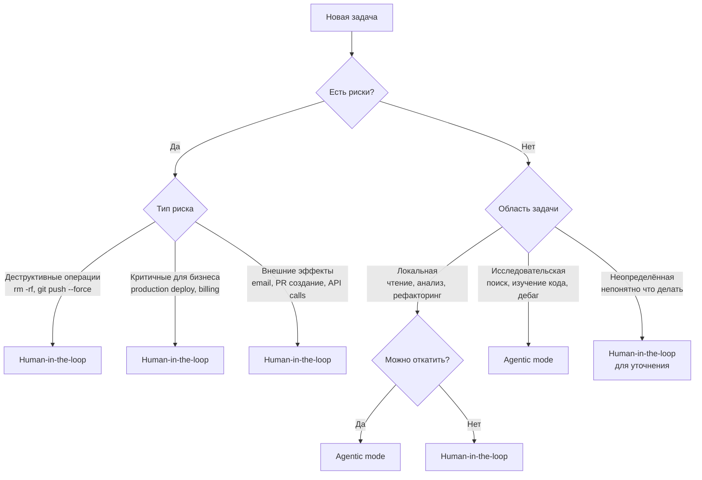

## 5. Human-in-the-loop vs Agentic mass generation

Агент может работать в двух режимах взаимодействия: **HITL** (Human-In-The-Loop — режим работы, при котором вы контролируете каждый шаг агента) и **agentic mass generation** (агент работает автономно, вы ревьюите результат). Выбор между ними зависит от критичности задачи, уровня доверия, и стоимости ошибки.

**Human-in-the-loop (HITL)**: агент предлагает действие → вы подтверждаете → агент выполняет → предлагает следующее. Пример: "Агент: Я собираюсь изменить функцию authenticate_user() в auth.py, чтобы добавить поддержку OAuth. Показать diff? Вы: Да, покажи. [Смотрите diff] Вы: ОК, применяй. Агент: Применил. Теперь нужно обновить тесты в tests/test_auth.py. Показать изменения?"

Когда использовать human-in-the-loop:
- **Критичный для бизнеса код**: логика платежей, обработка персональных данных, алгоритмы безопасности.
- **Unfamiliar territory**: задача в части кодовой базы, которую вы плохо знаете, или с технологией, с которой мало опыта (например, первый раз настраиваете Kubernetes).
- **Security-sensitive**: любые изменения, связанные с аутентификацией, авторизацией, шифрованием, обработкой credentials.
- **Production code без хороших тестов**: если нет safety net в виде comprehensive test suite, лучше контролировать каждый шаг.

**Agentic mass generation**: агент получает задачу, работает автономно (пишет код, запускает тесты, исправляет ошибки, итерирует), и возвращает результат — pull request или набор изменений для ревью. Вы проверяете результат post-factum.

Когда использовать agentic:
- **Рутинные задачи с известным паттерном**: добавление CRUD endpoints для новой сущности по аналогии с существующими, генерация API documentation, создание Pydantic schemas из database models.
- **Boilerplate код**: настройка нового микросервиса по шаблону, создание Docker Compose для development окружения, генерация миграций БД.
- **Тесты**: написание unit-тестов для уже существующей функции, добавление edge cases в тест-suite, генерация integration-тестов для API endpoints.
- **Хорошее покрытие тестами**: если есть comprehensive test suite, агент может экспериментировать — тесты поймают ошибки.

Алгоритм выбора режима:

1. Задача критична для бизнеса или безопасности? → **human-in-the-loop**
2. Код пойдёт в production без дополнительной проверки? → **human-in-the-loop** (минимум тщательное ревью после)
3. Есть хорошие автоматические проверки (тесты, линтер, type checker)? → можно **agentic**
4. Задача рутинная и вы делали подобное 10+ раз? → **agentic**
5. Работа с чувствительными данными (credentials, PII, финансы)? → **human-in-the-loop**
6. Вы не уверены в правильном подходе к решению? → **human-in-the-loop**

Оба режима имеют ограничения. Human-in-the-loop медленный: каждое подтверждение занимает время, разбивает поток работы. Agentic может генерировать некачественный код, если недостаточно контекста или слабые критерии приёмки. Модель **Enji Fleet** (учебный пример перехода к автономии): **начинать с human-in-the-loop, постепенно переходить к agentic** по мере настройки правил (AGENTS.md), накопления хороших тестов, и роста доверия к агенту на конкретных типах задач.

### 5.1. Алгоритм выбора режима работы



**Правило большого пальца:**
- **Agentic:** Если можно откатить `git reset --hard` или `Ctrl+Z`
- **Human-in-the-loop:** Если откат требует помощи других людей или невозможен

### 5.2. Типичные задачи по режимам

| Задача | Режим | Почему |
|--------|-------|--------|
| Найти все TODO в коде | Agentic | Только чтение, без рисков |
| Добавить unit тест | Agentic | Локальные изменения, легко откатить |
| Рефакторинг метода | Agentic | Git защищает, можно откатить |
| Исправить баг в feature branch | Agentic | Локальная ветка, нет внешних эффектов |
| Обновить README | Agentic | Документация, низкий риск |
| git push в main | **HITL** | Влияет на команду, нужна проверка |
| Создать PR | **HITL** | Публичное действие, видно всем |
| Удалить файлы/ветки | **HITL** | Деструктивно, hard to reverse |
| Изменить CI/CD конфиг | **HITL** | Критично для деплоя |
| Отправить email/Slack | **HITL** | Внешний эффект, нельзя откатить |
| Изменить production DB | **HITL** | Критично для бизнеса |
| Обновить зависимости | **HITL** (first time)<br/>Agentic (routine) | Может сломать сборку |

**В проекте Enji Fleet** (учебный пример Mad Devs):
- Agentic: добавление новых skills, рефакторинг конституции, обновление документации
- HITL: изменение core архитектуры, обновление dependencies, изменение AGENTS.md

Пример из **Enji Fleet** (демонстрация автономного промпта — файл `docs/prompts/code-implementation-prompt.md`):

> **Действуй автономно.** Не спрашивай разрешения на создание файлов, установку инструментов (go get, npm install), запуск тестов, исправление ошибок в коде. Ты можешь принимать решения в рамках задачи.
>
> **Спрашивай ТОЛЬКО если:**
> - Требования противоречивы и ты не можешь разрешить это сам
> - Невозможно продолжить из-за отсутствующей информации (например, API key для внешнего сервиса)
> - Критическая ошибка, которую ты не можешь исправить после 3 попыток
>
> **СТОП и исправь (блокирующие условия):**
> - Тест падает → исправь код, пока тест не пройдёт
> - go vet выдаёт ошибки → исправь все
> - Coverage упал ниже минимума → добавь тесты
> - Build падает → исправь, пока не соберётся

Это пример балансировки: агент автономен в рамках задачи (agentic generation), но с чёткими блокирующими правилами, которые предотвращают низкое качество.

## 6. Повышение качества через инструменты самопроверки

LLM генерирует код, который "выглядит правильно" — с правильным синтаксисом, идиоматичными паттернами, читаемой структурой. Но модель может пропустить subtle bugs (race conditions, off-by-one errors, неправильная обработка edge cases), security issues (SQL injection, XSS, небезопасное хранение credentials), или нарушения conventions проекта (использование deprecated API, неправильное именование, несоответствие code style).

Решение: **интегрировать детерминистические инструменты в workflow агента**. Это линтеры (проверка code style и потенциальных ошибок), type checkers (статическая проверка типов), тесты (функциональная корректность), security scanners (поиск известных уязвимостей). Эти инструменты не имеют "вероятностной природы" LLM — они детерминистически находят определённые классы проблем.

Практическая интеграция:

**1. Через hooks (автоматический запуск после изменений)**: настроить pre-commit hooks, которые запускаются при каждом коммите или сохранении файла. Если агент создаёт коммит, hook автоматически прогоняет линтер и тесты. Агент видит ошибки в выводе и исправляет. Пример pre-commit config для Python-проекта:

```yaml
repos:
  - repo: local
    hooks:
      - id: black
        name: Format code with Black
        entry: black --check
        language: system
        types: [python]
      - id: mypy
        name: Type check with mypy
        entry: mypy
        language: system
        types: [python]
      - id: pytest
        name: Run tests
        entry: pytest --tb=short
        language: system
        pass_filenames: false
```

**2. Через явные инструкции в AGENTS.md**: "После каждого изменения кода запусти: 1) `npm run lint` (ESLint), 2) `npm run type-check` (TypeScript compiler), 3) `npm test` (Jest). Если любая проверка падает — исправь проблему перед переходом к следующей задаче."

**3. TDD-подход (Test-Driven Development)**: особенно эффективен с агентами. Последовательность: сначала напишите тесты (или попросите агента написать на основе спецификации), затем реализация. Агент итерирует: пишет код → запускает тесты → видит failing tests → исправляет → тесты проходят → задача выполнена. Это создаёт tight feedback loop, где агент не может "забыть" про edge case — тест его поймает.

Пример промпта с TDD:
```
Задача: реализовать функцию parse_url(raw: str) -> ParsedURL, которая парсит URL.

Шаг 1: Напиши тесты в tests/test_url_parser.py, покрывающие:
- Валидный URL (https://example.com/path?query=1)
- URL без схемы (example.com → должен добавить https://)
- Пустая строка (должна вернуть ошибку)
- Невалидные символы в URL (должна вернуть ошибку)
- Очень длинный URL (10000+ символов)

Шаг 2: Реализуй функцию parse_url в url_parser.py так, чтобы ВСЕ тесты прошли.

Шаг 3: Запусти pytest. Если тесты падают — исправь код. Повторяй, пока все тесты не пройдут.
```

Агент не может сказать "готово", если pytest выдаёт ошибки. Это жёсткий критерий, не зависящий от субъективной оценки.

**Пример из практики**: Factory.ai написали статью "Using Linters to Direct Agents" с идеей "Never send an LLM to do a linter's job". Суть: не полагайтесь на LLM для соблюдения code style (форматирование, именование, порядок импортов) — это работа для автоматических инструментов. Настройте линтер с auto-fix (black для Python, prettier для JavaScript), и пусть агент просто запускает его после генерации кода. LLM хорош в высокоуровневой логике, линтер — в low-level consistency.

**Enji Fleet** (учебный пример Mad Devs) использует принцип **"Machine acceptance precedes human acceptance"**: перед тем как человек посмотрит на код, он должен пройти все автоматические проверки (go vet, go test, gofmt, golangci-lint). Агент не может создать PR с failing tests или ошибками линтера. Это снижает cognitive load на ревьюера — не нужно проверять форматирование, type errors, или забытые тесты.

## 7. Переключение между режимами

**Начинайте agentic, переходите на HITL при необходимости:**

```python
# Псевдокод workflow
mode = "agentic"

while not task_complete:
    action = ai.next_action()

    if is_risky(action):
        mode = "human-in-the-loop"
        approved = human.review(action)
        if not approved:
            continue

    execute(action)
```

**В Claude Code:**
1. Включите `auto` режим для исследовательских задач
2. Claude запросит подтверждение при рискованных действиях автоматически
3. Вы можете вручную запросить plan через `/plan` если неуверены

**Признаки что нужен HITL:**
- AI спрашивает "продолжить?" несколько раз подряд
- Задача касается production environment
- Вы не до конца понимаете что AI собирается делать
- Изменения влияют на других разработчиков

## Дополнительный материал: тестирование

Тестирование — критически важная часть AI-assisted разработки. Без тестов код от агента быстро разваливается. Подробный разбор unit, интеграционных и E2E тестов с примерами из реального проекта: [Тестирование в AI-assisted разработке](./testing-with-agents.md).
