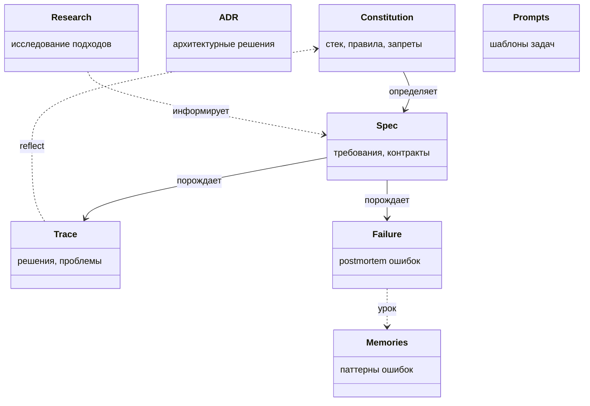

[← Оглавление](../../../README.md)

# Иерархия артефактов SDD

Три уровня стабильности: чем выше — тем реже меняется. На каждом уровне несколько типов артефактов.

**Как они взаимодействуют:**

| Уровень | Артефакты | Частота изменений | Кто пишет |
|---------|-----------|-------------------|-----------|
| Проект | `AGENTS.md`, `memories/`, ADR | Раз в неделю (reflect-mode) | Человек + reflect-агент |
| Фича | `specs/003-auth.md`, research, prompt templates | Раз на фичу | Человек |
| Сессия | `traces/003-auth.trace.md`, failure postmortems | Каждая сессия | Агент |

**Обратная связь:** failures и traces поднимаются наверх — reflect-агент анализирует их и обновляет memories и constitution. Так ошибки не повторяются.
