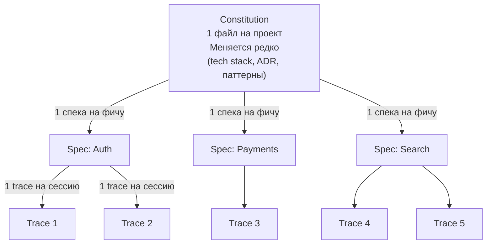

# Иерархия артефактов SDD

Три уровня артефактов: чем выше — тем стабильнее документ и тем реже он меняется. Constitution один на проект, Spec один на фичу, Trace один на сессию.

**Как они взаимодействуют:**

| Уровень | Документ | Частота изменений | Кто пишет |
|---------|----------|-------------------|-----------|
| Constitution | `AGENTS.md` / `constitution.md` | Раз в неделю (reflect-mode) | Человек + reflect-агент |
| Specification | `specs/003-auth.md` | Раз на фичу | Человек |
| Trace | `traces/003-auth.trace.md` | Каждая сессия | Агент |
