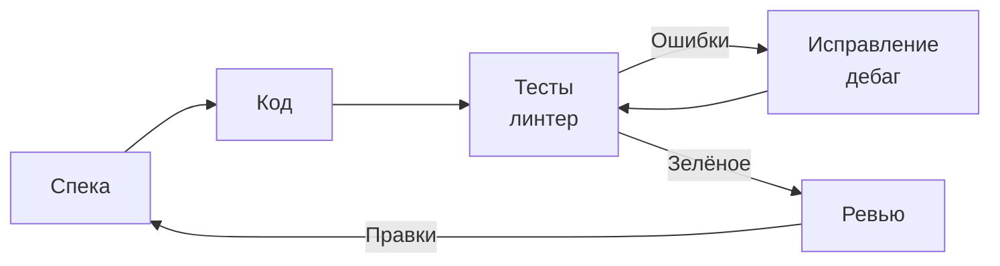
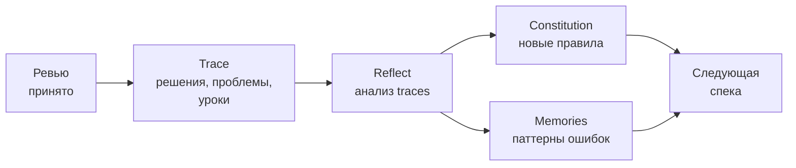

# SDD-цикл (Spec-Driven Development)

Два вложенных цикла: внутренний (агент итерирует до зелёных тестов) и внешний (знания накапливаются между фичами).

**Внутренний цикл — агент реализует фичу:**

**Внешний цикл — знания накапливаются между фичами:**

**Почему это цикл, а не линейный процесс:**
- **Тесты + дебаг** — агент не сдаёт код с первой попытки, он итерирует до зелёных тестов
- **Trace** фиксирует решения, проблемы и найденные workarounds
- **Reflect-mode** анализирует traces и обновляет constitution (раз в N задач)
- **Memories** сохраняют паттерны ошибок — агент не повторяет одни и те же промахи
- С каждой итерацией агент работает точнее, потому что knowledge base растёт