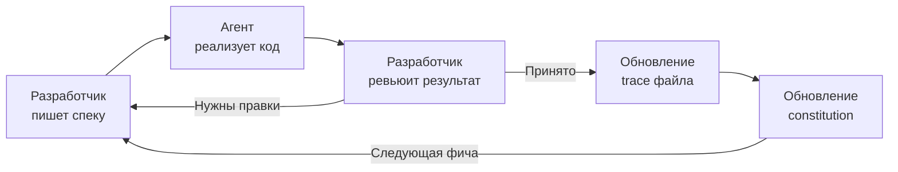

# SDD-цикл (Spec-Driven Development)

Замкнутый цикл: разработчик пишет спеку, агент реализует, результат ревьюится, знания накапливаются в артефактах и переиспользуются для следующей фичи.

**Почему это цикл, а не линейный процесс:**
- Trace фиксирует решения и проблемы текущей задачи
- Constitution обновляется на основе traces (reflect-mode)
- Следующая спека пишется с учетом обновленной constitution
- С каждой итерацией агент работает точнее, потому что knowledge base растет
