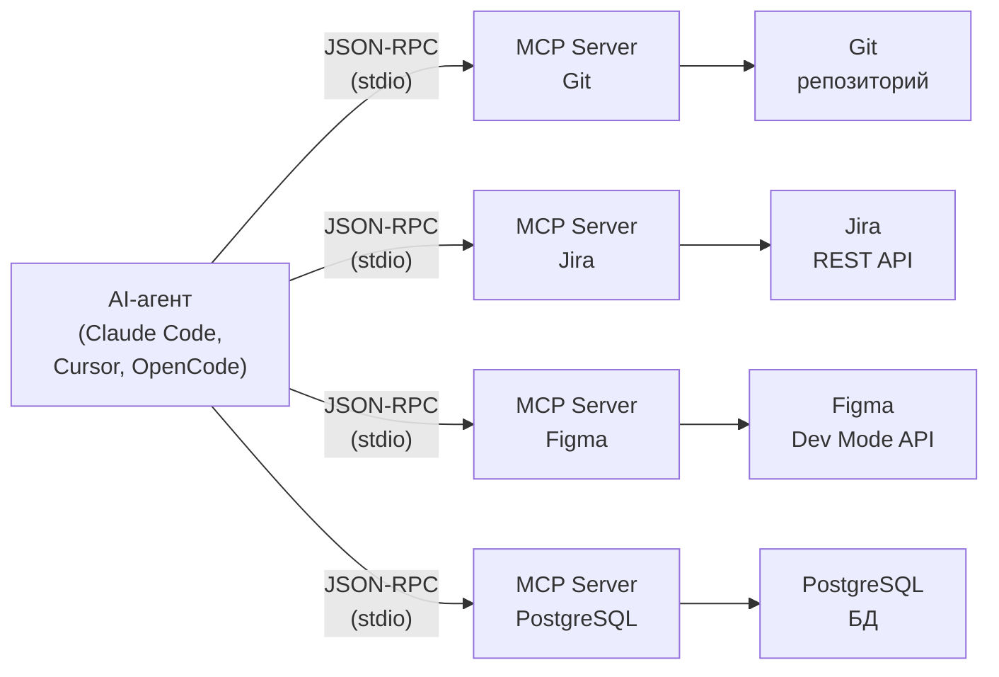

[← Оглавление](../../../README.md)

# Архитектура MCP: Client -> Server -> Tool

Один AI-агент подключается к нескольким MCP-серверам. Каждый сервер — адаптер между агентом и конкретным внешним инструментом. Протокол единый (JSON-RPC), инструменты — разные.

**Аналогия:** MCP — это "USB для AI". Как USB позволяет подключить любое устройство к компьютеру через единый разъем, MCP позволяет подключить любой инструмент к AI-агенту через единый протокол.

**Ключевые свойства:**
- Один MCP-сервер работает со всеми AI-агентами, поддерживающими протокол
- Агент не знает деталей API каждого инструмента — MCP-сервер абстрагирует их
- Серверы запускаются как отдельные процессы, общение через stdin/stdout
