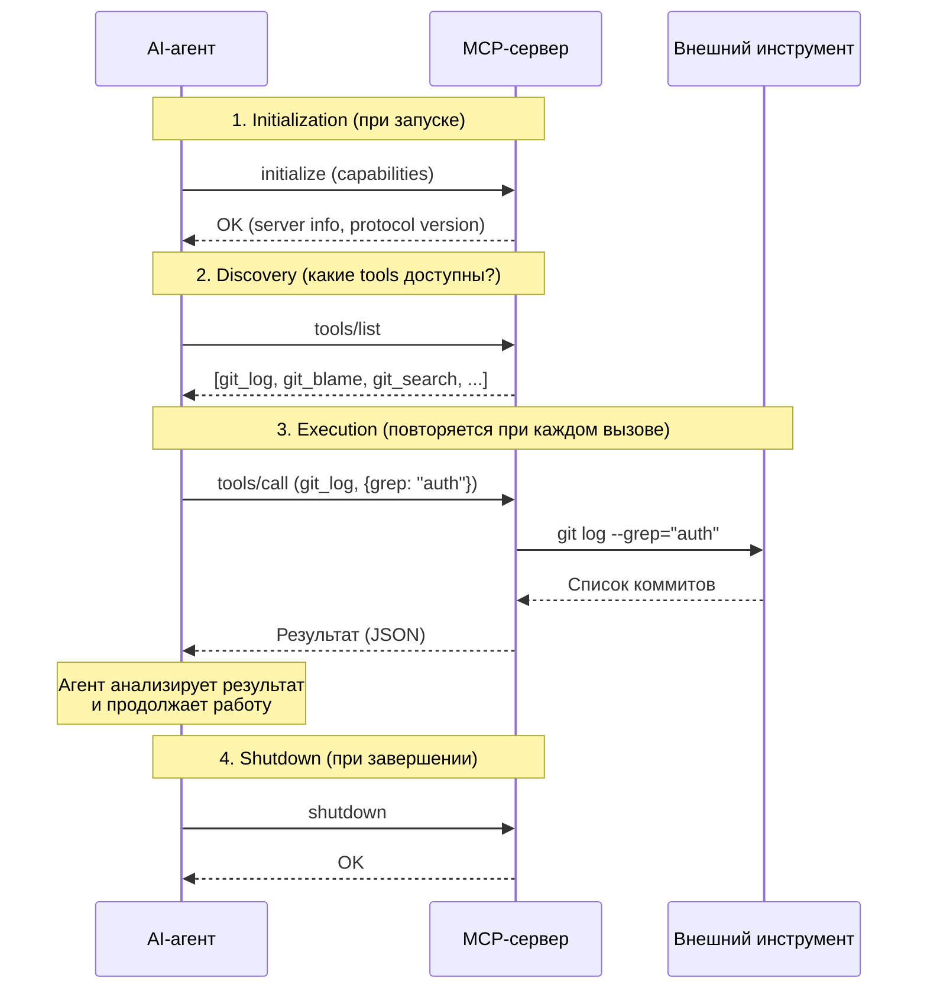

[← Оглавление](../../../README.md)

# Жизненный цикл MCP-вызова

Что происходит "под капотом", когда агент использует MCP-инструмент: от инициализации до shutdown.

**Что важно понимать:**
- Discovery происходит один раз — агент узнает, какие инструменты доступны
- Execution повторяется многократно за сессию
- Агент сам решает, когда вызвать какой tool — на основе контекста задачи
- Если сервер не отвечает — агент может продолжить работу без этого инструмента
