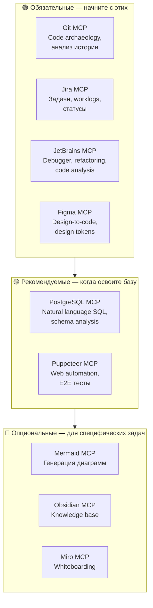

# Карта MCP-серверов по приоритету

С чего начать и в каком порядке расширять набор MCP-серверов. Начните с обязательных четырех, затем добавляйте по необходимости.

> [!TIP]
> Не устанавливайте все серверы сразу. 3-5 активных серверов — оптимум. Больше 10 — деградация производительности.
