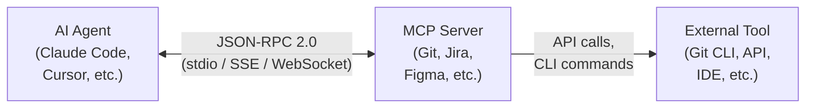

[← Оглавление](../../../README.md)

# Модуль 6: Model Context Protocol (MCP)

## 1. Что такое MCP и зачем он нужен

Агент может работать в рамках сэндбокса вашего проекта. Однако у него нет доступа ко внешним системам.

Хотелки:
- **Task tracking**: автоматическое логирование времени в Jira, обновление статусов
- **Design-to-code**: генерация кода с точными значениями из Figma design tokens
- **Debugging**: breakpoints и step-through через IDE

Базовые возможности (файловая система + терминал) не покрывают эти сценарии.

> [!NOTE]
> MCP — это не замена встроенных инструментов агента (файлы, терминал, git). Это расширение для задач, которые требуют доступа к внешним системам: трекеры, дизайн, IDE, базы данных.

### Решение: MCP

**Model Context Protocol (MCP)** — универсальный стандарт для подключения инструментов к LLM. Все AI-инструменты используют единый протокол вместо собственных интеграций.

**Ресурсы:** [modelcontextprotocol.io](https://modelcontextprotocol.io) · [Спецификация](https://modelcontextprotocol.io/specification/2025-11-25) · [Серверы](https://github.com/modelcontextprotocol/servers) · [Каталог (1200+)](https://mcp-awesome.com/)

```
Claude, запушь ветку, подготовь PR, опиши по формату, сделай комментарии в гите для важных деталей
→ Git MCP выполняет git операции для подготовки PR

Claude, реализуй задачу PROJ-123 и залогируй время в Jira, когда закончишь
→ Jira MCP читает задачу, создает worklog, обновляет статус

Claude, проведи дебаггинг всего флоу в auth.py
→ JetBrains MCP взаимодействует с отладчиком IDE, ставит брейкпоинты, запускает сервер

Claude, сгенерируй React компонент из Figma компонента "UserCard"
→ Figma MCP читает структуру слоев, design tokens, auto-layout
```

---

## 2. Архитектура MCP

### Client-Server модель

> [Диаграмма: Архитектура MCP](../diagrams/mcp-architecture.md)



**Компоненты:**

1. **MCP Client** (встроен в AI-агент): Claude Code, Cursor, OpenCode
2. **MCP Server**: Node.js/Python-процесс, предоставляющий доступ к инструменту
3. **External Tool**: Git CLI, Jira REST API, Figma API, IDE

MCP использует **JSON-RPC 2.0**. Это простой текстовый протокол на базе JSON для связи клиента и сервера.

### Transport

| Тип | Описание | Когда использовать |
|-----|----------|-------------------|
| **stdio** | stdin/stdout локального процесса | Локальные серверы (основной для курса) |
| **SSE** | HTTP Server-Sent Events | Удаленные/cloud серверы |
| **WebSocket** | Полнодуплексный протокол | Real-time (live debugging) |

### Жизненный цикл MCP-вызова

> [Диаграмма: Жизненный цикл MCP-вызова](../diagrams/mcp-lifecycle.md)

1. **Initialization**: агент читает `mcp.json`, запускает серверы, отправляет `initialize`
2. **Discovery**: агент запрашивает `tools/list`, сервер возвращает доступные tools
3. **Execution**: AI решает вызвать tool → `tools/call` с параметрами → сервер выполняет → результат
4. **Shutdown**: агент отправляет `shutdown`, серверы завершают работу
---

[← Чеклист и следующие шаги](../../module-5-context-engineering/practice/06-checklist.md) | [Оглавление](../../../README.md) | [3. Категории MCP-серверов →](02-mcp-servers.md)
