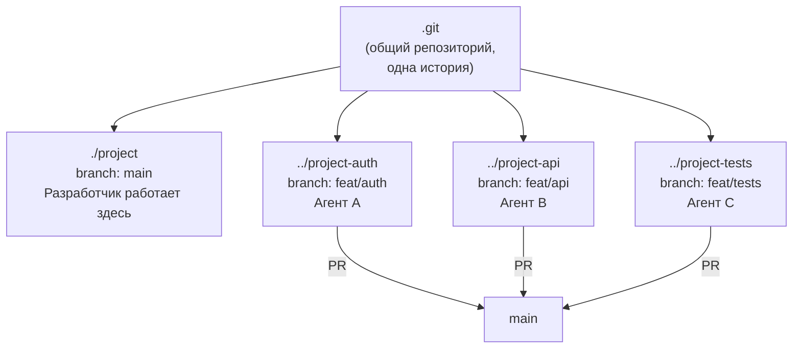

# Git Worktree: изоляция агентов

Один Git-репозиторий, одна `.git` директория, но несколько рабочих копий. Каждый агент работает в своей директории на своей ветке. Агенты не видят незакоммиченные изменения друг друга.



**Правило:** каждый план = отдельный worktree. Агент начинает — создаем worktree. Агент закончил — удаляем worktree. Это предотвращает 90% конфликтов.

**Команды:**
```bash
git worktree add ../project-auth -b feat/auth   # создать
git worktree remove ../project-auth              # удалить
```
