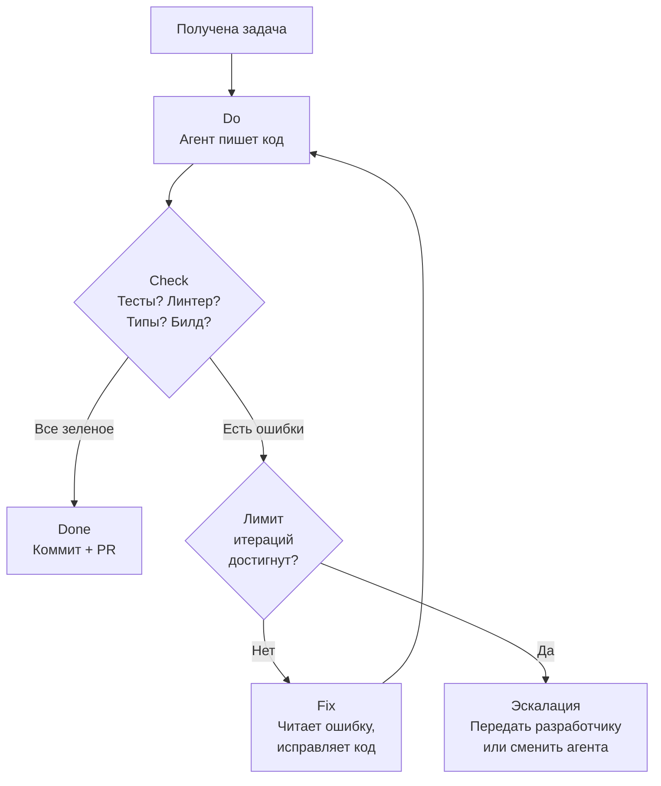

[← Оглавление](../../../README.md)

# Ralph Loop: цикл автономной работы агента

Ralph Loop — паттерн, при котором агент работает в цикле Do -> Check -> Fix до тех пор, пока все проверки не пройдут. Критерий остановки — не "я написал код", а "все тесты зеленые".

**Две точки выхода:**
- **Done** — все автоматические проверки прошли, агент создает коммит и PR
- **Эскалация** — после N итераций (например, 50) или по таймауту агент признает, что не справляется, и передает задачу человеку или другому агенту (hot-swap)
