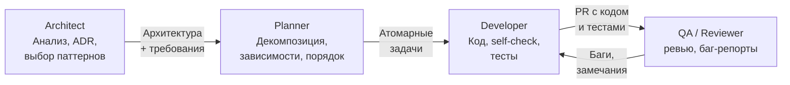

# Ролевая модель агентов

Четыре роли агентов образуют цепочку: от архитектуры к реализации и обратно через ревью. Каждая роль использует свою модель, оптимизируя баланс стоимости и качества.

**Принцип:** не тратить Opus ($15/1M tokens) на boilerplate. Не ставить Haiku ($0.80/1M tokens) на архитектуру. Каждой роли — своя модель:

| Роль | Модель | Стоимость | Задачи |
|------|--------|-----------|--------|
| Architect | Opus | $$$ | Дизайн, ADR, выбор стека |
| Planner | Sonnet | $$ | Декомпозиция, зависимости |
| Developer | Haiku | $ | Код по спецификации, тесты |
| QA | Sonnet | $$ | Ревью, интеграционные тесты |
