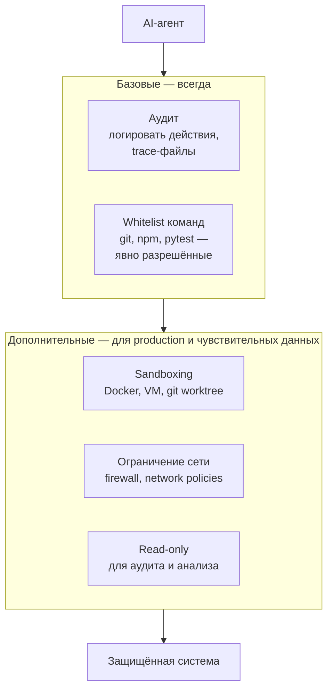

# Defence in Depth: многослойная защита

Безопасность — комбинация слоёв. Базовые слои нужны всегда, дополнительные — по контексту.

**Принцип:** каждый слой работает независимо. Аудит + whitelist — минимум для любого проекта. Sandboxing, сеть и read-only добавляйте когда агент работает с production-данными, внешними сервисами или чувствительным кодом.