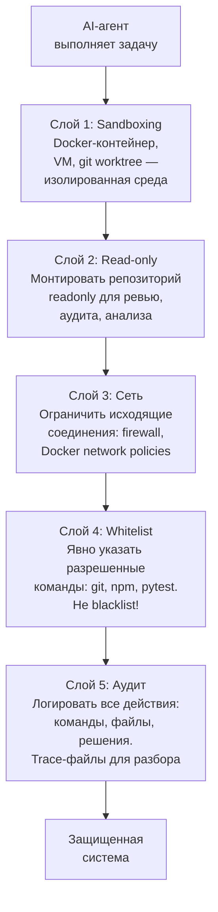

# Defence in Depth: многослойная защита

Безопасность — это не одна мера, а комбинация слоев. Каждый слой ловит то, что пропустил предыдущий. Если скомпрометирован один слой — остальные все еще защищают.

**Принцип:** каждый слой работает независимо. Даже если агент обошел sandboxing — read-only режим не даст записать. Даже если записал — whitelist не даст выполнить опасную команду. Даже если выполнил — аудит зафиксирует для разбора.
