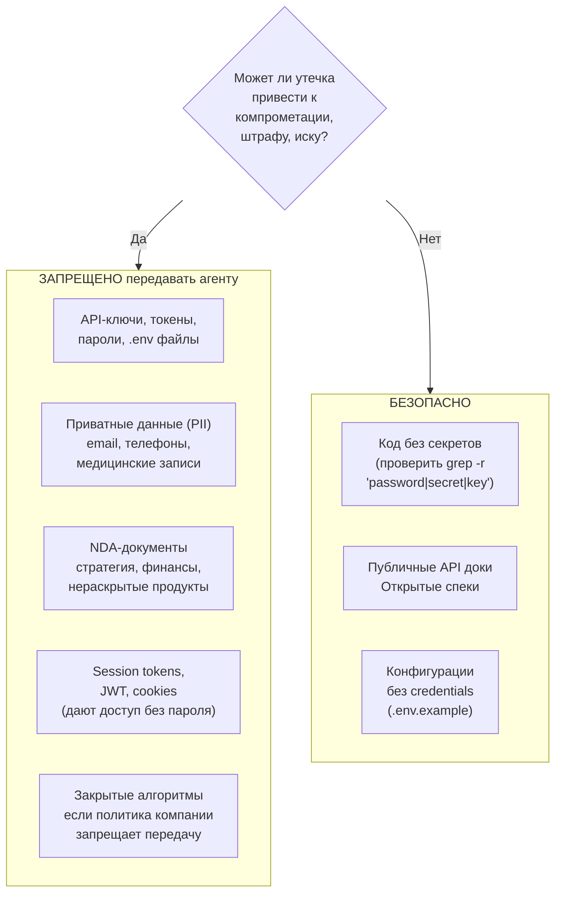

# Что НЕЛЬЗЯ отправлять в контекст ИИ

Данные, которые ни при каких обстоятельствах не должны попадать в промпты или файлы, доступные агенту. Правило: если утечка = компрометация — данные не для ИИ.

**Штрафы за утечку:**
- GDPR: до 20 млн евро или 4% глобального оборота
- HIPAA: до $1.5 млн в год
- Утечка API-ключей: несанкционированный доступ к системам
