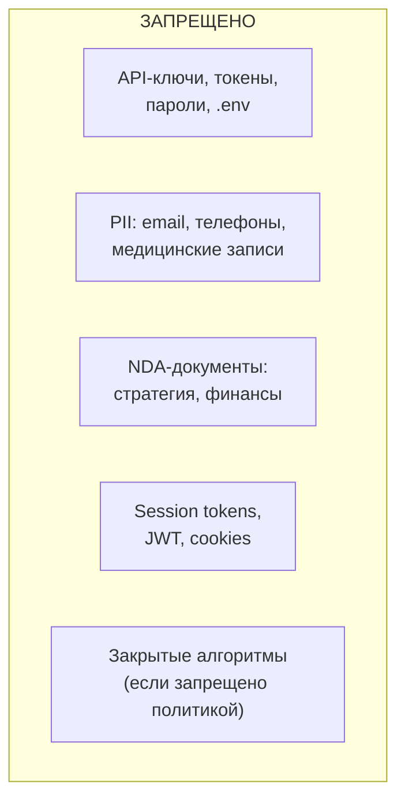
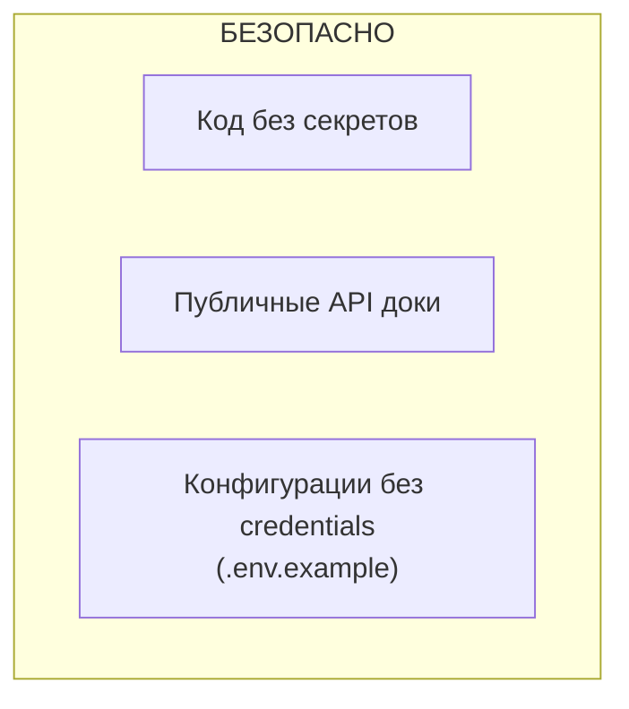

<!-- Space: CTO -->
<!-- Parent: AI adoption course -->
<!-- Parent: Модуль 8. Ответственность -->
<!-- Parent: Модуль 8. Ответственность — Диаграммы -->
<!-- Title: Что НЕЛЬЗЯ отправлять в контекст ИИ -->

# Что НЕЛЬЗЯ отправлять в контекст ИИ

Правило: если утечка = компрометация — данные не для ИИ.

```mermaid
flowchart TD
    subgraph forbidden["ЗАПРЕЩЕНО"]
        F1["API-ключи, токены,<br>пароли, .env"]
        F2["PII: email, телефоны,<br>медицинские записи"]
        F3["NDA-документы:<br>стратегия, финансы"]
        F4["Session tokens,<br>JWT, cookies"]
        F5["Закрытые алгоритмы<br>(если запрещено политикой)"]
    end
```

```mermaid
flowchart TD
    subgraph safe["БЕЗОПАСНО"]
        S1["Код без секретов"]
        S2["Публичные API доки"]
        S3["Конфигурации без credentials<br>(.env.example)"]
    end
```
