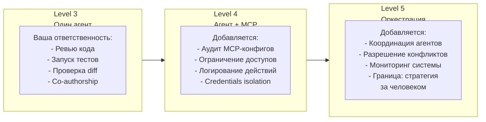

# Ответственность по уровням

Чем больше автономности у агента — тем выше ваша ответственность за настройку и контроль. На каждом уровне добавляется новая зона ответственности.

**Ключевой принцип:** код от ИИ = ваш код. На всех уровнях финальная ответственность за результат — на человеке. Агент — это инструмент, не субъект ответственности.
