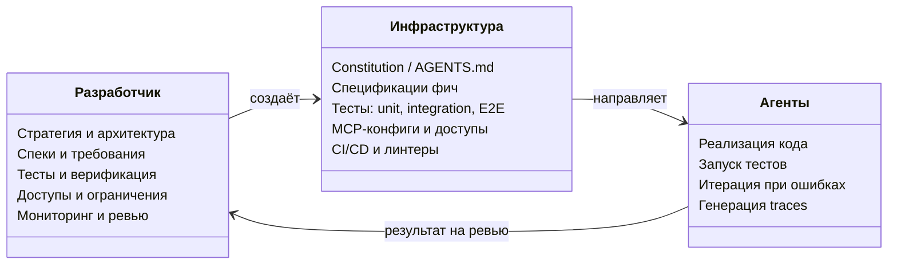

[← Оглавление](../../../README.md)

# Роль разработчика в AI-assisted разработке

Agentic-разработчик — не кодер. Это инженер, который решает задачи бизнеса, управляя системой из агентов. Его работа — создать инфраструктуру, в которой агенты эффективны.

**Ключевой принцип:** код от ИИ = ваш код. Разработчик не пишет код руками — он создаёт среду (спеки, тесты, правила, доступы), в которой агенты производят качественный результат. Стратегия и финальная ответственность — всегда за человеком.
