# План по добавлению иллюстраций и диаграмм в курс

## Общие принципы

### Формат и инструментарий

| Тип визуала | Формат | Инструмент | Причина выбора |
|-------------|--------|------------|----------------|
| Блок-схемы, flowcharts | Mermaid (в Markdown) | Mermaid syntax в `.md` файлах | Версионируется в Git, редактируется как текст, рендерится в GitHub/GitLab/Obsidian |
| Архитектурные схемы | Mermaid или SVG | Mermaid для простых, Excalidraw/draw.io для сложных → экспорт в SVG | SVG масштабируется без потерь |
| Таблицы-матрицы | Markdown tables | Уже используются в курсе | Консистентность |
| Скриншоты интерфейсов | PNG | Реальные скриншоты инструментов | Аутентичность |
| ASCII-схемы | Текст в code blocks | Текстовый редактор | Для простых линейных схем, не требуют рендеринга |

### Правила оформления

1. Все Mermaid-диаграммы размещаются inline в `.md` файлах (внутри ` ```mermaid ` блоков)
2. Сложные SVG/PNG хранятся в `course/<module>/assets/`
3. Язык подписей на диаграммах: **русский** (кроме технических терминов: CLI, MCP, SDD, worktree)
4. Без emoji на диаграммах (согласно guidelines курса)
5. Цветовая схема: нейтральная, без ярких цветов. Mermaid использует дефолтную тему
6. Каждая диаграмма сопровождается краткой подписью в тексте, объясняющей что на ней изображено

---

## Модуль 0: Введение в курс

### V1.2 — Эволюция разработки (timeline)

**Что:** Горизонтальная шкала времени: ассемблер → компиляторы → IDE → фреймворки → ИИ-агенты.

**Зачем:** Показать, что ИИ — не революция, а следующий шаг в естественной эволюции инструментов. Снимает страх ("ИИ заменит разработчиков") и хайп ("ИИ решит все проблемы").

**Как выглядит:** Горизонтальная линия с точками-эпохами. Под каждой точкой — что автоматизировалось. Акцент: каждый раз разработчики поднимались на уровень абстракции выше, но не исчезали.

**Формат:** Mermaid flowchart LR

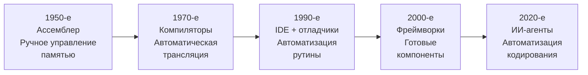

**Где разместить:** `course/module-1-why-ai/theory.md`, в начале — секция "Эволюция разработки"

---

### V1.3 — Матрица навыков по уровням

**Что:** Таблица-матрица, где строки — навыки (промптинг, надзор, контекст, автономность, инструменты, ревью), столбцы — уровни 1-5. В ячейках — краткое описание навыка на данном уровне.

**Зачем:** Позволяет студенту точно определить свой уровень по каждому навыку. Текстовое описание каждого уровня отдельно не дает сравнения.

**Как выглядит:** Markdown-таблица 7 строк x 6 столбцов. Компактные формулировки в ячейках.

**Формат:** Markdown table (уже частично есть в тексте, нужно формализовать в единую визуальную таблицу)

| Навык | Уровень 1 | Уровень 2 | Уровень 3 | Уровень 4 | Уровень 5 |
|-------|-----------|-----------|-----------|-----------|-----------|
| Промптинг | "Как сделать X?" | Tab-completion | Задача с контекстом | Спецификация | Runbook для флита |
| Надзор | Копировать as-is | Принять/отклонить | Проверить diff | Ревью PR | Мониторинг метрик |
| Контекст | Нет | Файл в IDE | AGENTS.md | Constitution + Spec | Memory bank |
| Автономность | 0% | 10-20% строк | Целая задача | Целая фича | Несколько фич |
| Инструменты | Браузерный чат | IDE-плагин | CLI-агент | Агент + MCP | Несколько агентов |
| Ревью | Нет | Подсказки IDE | Diff одного агента | PR от агента | PR от нескольких агентов |

**Где разместить:** `course/module-1-why-ai/theory.md`, после описания всех уровней; `course/self-assessment.md` — дублировать для самодиагностики

---

## Модуль 2: Ландшафт инструментов

### V2.1 — Карта категорий инструментов

**Что:** Четыре категории инструментов (чаты, копилоты, AI-IDE, CLI-агенты), расположенные как вложенные области. Каждая следующая категория включает возможности предыдущей.

**Зачем:** Показать, что категории не альтернативы, а уровни: CLI-агент может всё, что может чат, плюс больше. Студент понимает зачем нужны разные инструменты.

**Как выглядит:** Концентрические прямоугольники (или Mermaid subgraph). Внутренний — чаты, следующий — копилоты, затем AI-IDE, внешний — CLI-агенты. В каждом слое — примеры инструментов.

**Формат:** Mermaid flowchart

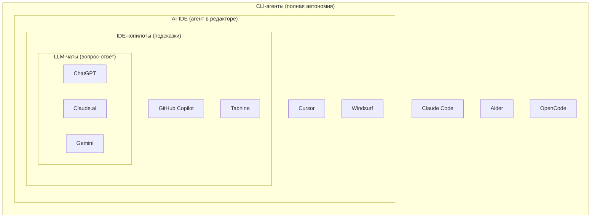

**Где разместить:** `course/module-2-tools/theory.md`, в начале — обзор категорий

---

### V2.2 — Стратегия выбора модели (decision tree)

**Что:** Дерево решений: какую модель использовать для какой задачи.

**Зачем:** Студенты путаются в многообразии моделей. Простой алгоритм "если X — используй Y" снимает неопределённость.

**Как выглядит:** Flowchart с вопросами-развилками: "Задача требует рассуждений?" → Да → "Бюджет позволяет?" → Да → Opus / → Нет → Sonnet. И т.д.

**Формат:** Mermaid flowchart TD

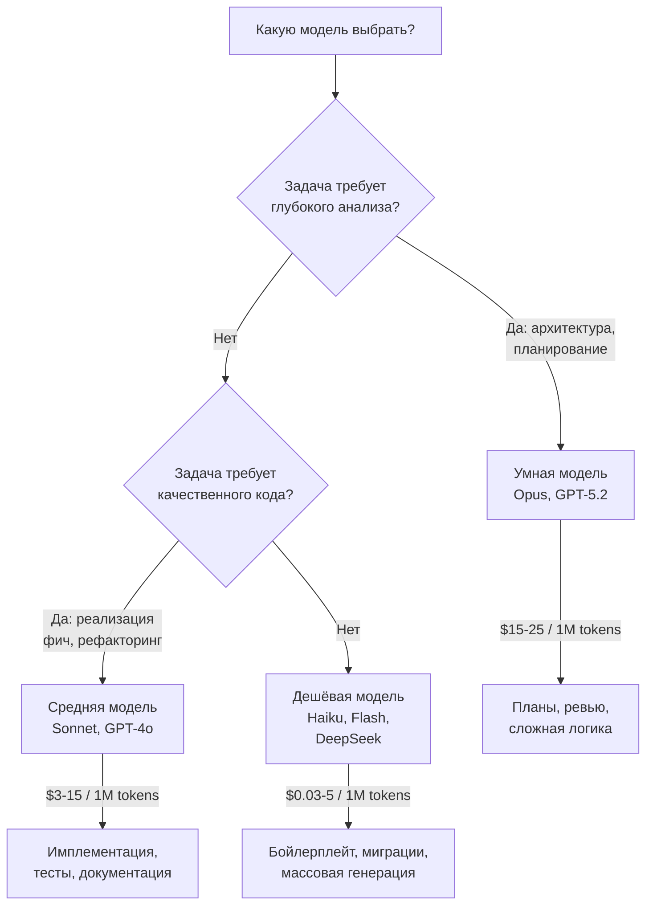

**Где разместить:** `course/module-2-tools/theory.md`, секция "Мульти-модельная стратегия"

---

### V2.3 — Схема оптимизации затрат

**Что:** Диаграмма показывающая три способа сэкономить: кэширование промптов, Batch API, выбор модели.

**Зачем:** Бюджет — реальное ограничение для студентов. Визуализация показывает конкретные проценты экономии.

**Как выглядит:** Три параллельных пути от "Полная цена" к "Оптимизированная цена" с указанием процента экономии на каждом.

**Формат:** Mermaid flowchart LR

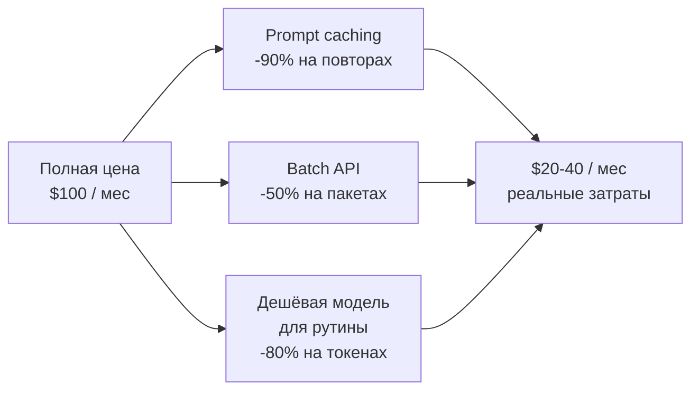

**Где разместить:** `course/module-2-tools/theory.md`, секция про стоимость

---

## Модуль 3: Промптинг

### V3.1 — Структура промпта (4 блока)

**Что:** Визуальная схема структуры промпта: Роль → Контекст → Задача → Критерии приёмки.

**Зачем:** Студенты запоминают структуру визуально лучше, чем из текста. Эта схема — ментальный шаблон для каждого промпта.

**Как выглядит:** Четыре блока сверху вниз, каждый с названием и примером содержимого. Блоки визуально отличаются (разные формы в Mermaid).

**Формат:** Mermaid flowchart TD

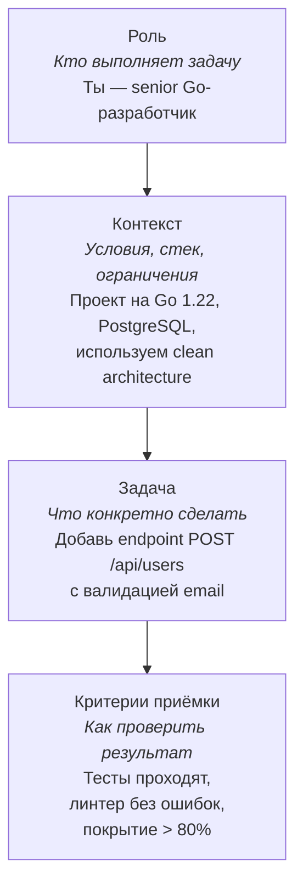

**Где разместить:** `course/module-3-prompting/theory.md`, секция "Структура промпта"

---

### V3.2 — Антипаттерны промптинга (до/после)

**Что:** Визуальное сравнение плохого и хорошего промпта в формате "было → стало".

**Зачем:** Показать конкретную разницу между расплывчатым и структурированным промптом. Текстовые примеры в курсе есть, но визуальное side-by-side сравнение запоминается лучше.

**Как выглядит:** Две колонки. Левая (красная/серая) — плохой промпт с пометками что не так. Правая (зеленая/белая) — хороший промпт с аннотациями.

**Формат:** ASCII-блок в code-fence (два блока рядом в тексте), или Markdown blockquote с аннотациями

Пример:

```
ПЛОХО                              ХОРОШО
─────────────────                  ─────────────────
"Сделай лучше этот код"            "Роль: Senior Python-разработчик
                                    Контекст: FastAPI 0.104, Python 3.12
 - Нет роли                        Задача: Рефакторинг функции
 - Нет контекста                   process_payment (строки 45-120)
 - Нет конкретики                  — разбить на 3 функции по SRP
 - Нет критериев                   — сохранить все существующие тесты
                                    Критерии:
                                    — mypy --strict без ошибок
                                    — pytest проходит
                                    — функции < 25 строк каждая"
```

**Где разместить:** `course/module-3-prompting/theory.md`, секция "Антипаттерны"

---

### V3.3 — Цепочка промптов (Prompt Chaining)

**Что:** Последовательность шагов в цепочке промптов с указанием входа/выхода каждого шага.

**Зачем:** Prompt chaining — ключевая техника, которая плохо воспринимается из текста. Визуализация потока "вход → обработка → выход → вход следующего шага" делает концепцию очевидной.

**Как выглядит:** Горизонтальная цепочка блоков. Каждый блок — один промпт. Стрелка между блоками показывает, что выход предыдущего = вход следующего.

**Формат:** Mermaid flowchart LR

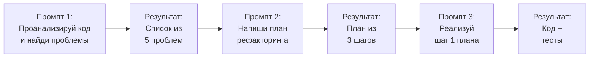

**Где разместить:** `course/module-3-prompting/theory.md`, секция "Prompt Chaining"

---

## Модуль 4: Работа с агентами

### V4.1 — Цикл работы агента (Agent Loop)

**Что:** Циклическая диаграмма: Plan → Act → Observe → Adjust → (repeat).

**Зачем:** Ключевая концепция агентной работы. Студент должен понимать, что агент работает итеративно, а не "сделал и всё". Уже есть текстовое описание, но нет визуализации цикла.

**Как выглядит:** Круговая диаграмма с 4 фазами, стрелки по кругу. В центре — "Agent Loop".

**Формат:** Mermaid flowchart

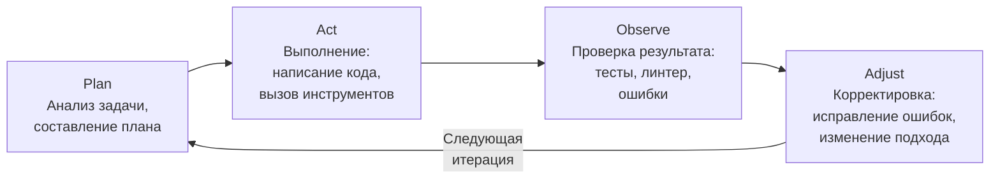

**Где разместить:** `course/module-4-agents/theory.md`, секция "Как работают агенты"

---

### V4.2 — Режимы работы: Plan vs Act

**Что:** Два параллельных потока: режим Plan (только чтение и анализ) и режим Act (запись и исполнение). С примерами действий в каждом.

**Зачем:** Студенты путают эти режимы. Визуальное разделение показывает, что в Plan-режиме агент ничего не меняет, а в Act — меняет.

**Как выглядит:** Два столбца с действиями.

**Формат:** Mermaid flowchart

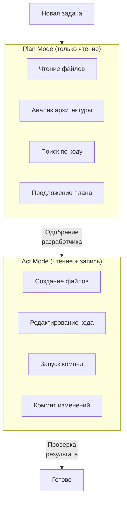

**Где разместить:** `course/module-4-agents/theory.md`, секция "Plan vs Act"

---

### V4.3 — Алгоритм выбора режима (HITL vs Agentic)

**Что:** Уже существует как Mermaid-диаграмма в `course/module-4-agents/theory.md:147-165`. Нуждается в доработке — рецензия предлагала упростить.

**Зачем:** Помогает студенту принять решение: какой режим надзора использовать для конкретной задачи.

**Действие:** Оставить существующую Mermaid-диаграмму, убедиться что рендерится корректно. Добавить текстовый fallback (список правил) для тех, у кого Mermaid не рендерится.

**Где:** `course/module-4-agents/theory.md:145-165` — уже размещена

---

### V4.4 — Структура AGENTS.md

**Что:** Визуальная схема структуры файла AGENTS.md с секциями и их назначением.

**Зачем:** AGENTS.md — ключевой артефакт курса. Визуализация структуры помогает запомнить обязательные секции.

**Как выглядит:** Вертикальный список блоков-секций с кратким описанием.

**Формат:** Mermaid flowchart TD

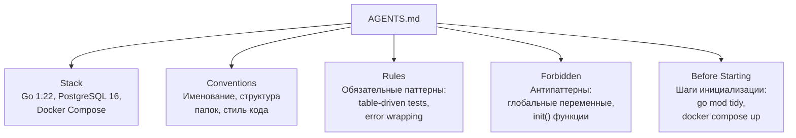

**Где разместить:** `course/module-4-agents/theory.md`, секция "AGENTS.md"

---

## Модуль 5: Spec-Driven Development

### V5.1 — SDD-цикл (Spec → Implement → Review → Iterate)

**Что:** Циклическая диаграмма SDD-процесса: Разработчик пишет спеку → Агент реализует → Разработчик ревьюит → Итерация → Обновление trace → Обновление constitution.

**Зачем:** SDD-цикл упоминается в рецензиях как уже "визуализированный" текстом, но Mermaid-диаграммы нет. Нужна формальная визуализация.

**Как выглядит:** Цикл с 5 шагами и обратной связью.

**Формат:** Mermaid flowchart

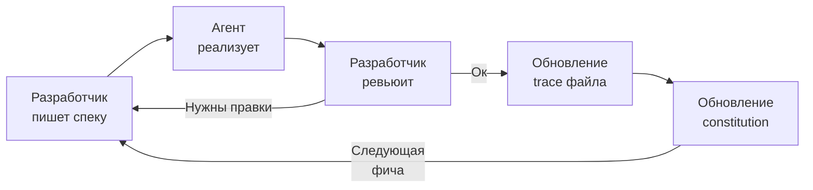

**Где разместить:** `course/module-5-sdd/theory.md`, в начале — описание SDD-процесса

---

### V5.2 — Иерархия артефактов (пирамида)

**Что:** Пирамида артефактов: Constitution (вершина, один на проект) → Specifications (средний уровень, одна на фичу) → Traces (основание, один на сессию).

**Зачем:** Показать отношения между артефактами: constitution стабильный и редко меняется, спеки создаются для каждой фичи, trace — для каждой сессии. Формирует ментальную модель "чем выше — тем стабильнее".

**Как выглядит:** Три уровня. Верхний — самый узкий (1 файл), нижний — самый широкий (много файлов).

**Формат:** Mermaid flowchart TD

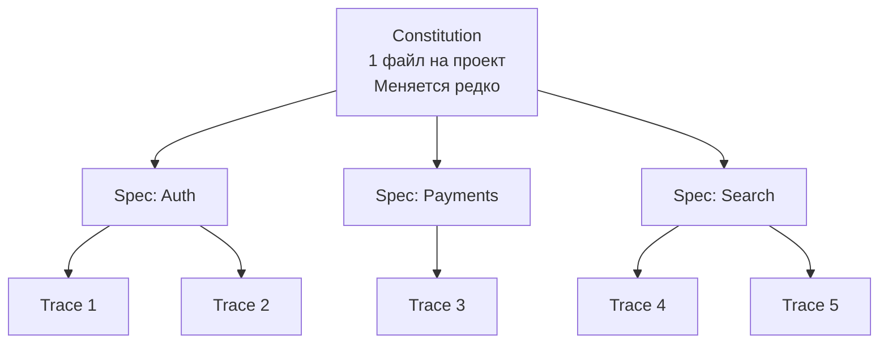

**Где разместить:** `course/module-5-sdd/theory.md`, секция "Артефакты"

---

### V5.3 — Пример Progress Table

**Что:** Визуальный пример таблицы прогресса задач, которую агент ведёт в trace-файле.

**Зачем:** Рецензия (student-experience-report) прямо указывает: "Добавить небольшой скриншот или визуальный пример Progress Table с реальными статусами задач".

**Как выглядит:** Markdown-таблица с колонками: задача, статус, итерации, результат.

**Формат:** Markdown table

| # | Задача | Статус | Итерации | Результат |
|---|--------|--------|----------|-----------|
| 1 | Создать модели данных | done | 2 | `models/user.go` создан, тесты зеленые |
| 2 | Написать API endpoint | done | 3 | `handlers/user.go`, линтер ок |
| 3 | Добавить валидацию | in progress | 1 | Работа идет... |
| 4 | Интеграционные тесты | pending | 0 | — |
| 5 | Документация API | pending | 0 | — |

**Где разместить:** `course/module-5-sdd/theory.md`, секция про trace-файлы и автономные промпты

---

## Модуль 6: MCP (Model Context Protocol)

### V6.1 — Архитектура MCP (Client ↔ Server ↔ Tool)

**Что:** Трехслойная архитектура: AI-агент (клиент) ↔ MCP-сервер (адаптер) ↔ Внешний инструмент (Git, Jira, Figma, БД).

**Зачем:** Ключевая концепция модуля. Аналогия "USB для AI" хороша в тексте, но архитектурная схема закрепляет понимание.

**Как выглядит:** Три слоя слева направо. Один клиент подключен к нескольким серверам, каждый сервер — к своему инструменту. Протокол JSON-RPC 2.0 обозначен на стрелках.

**Формат:** Mermaid flowchart LR

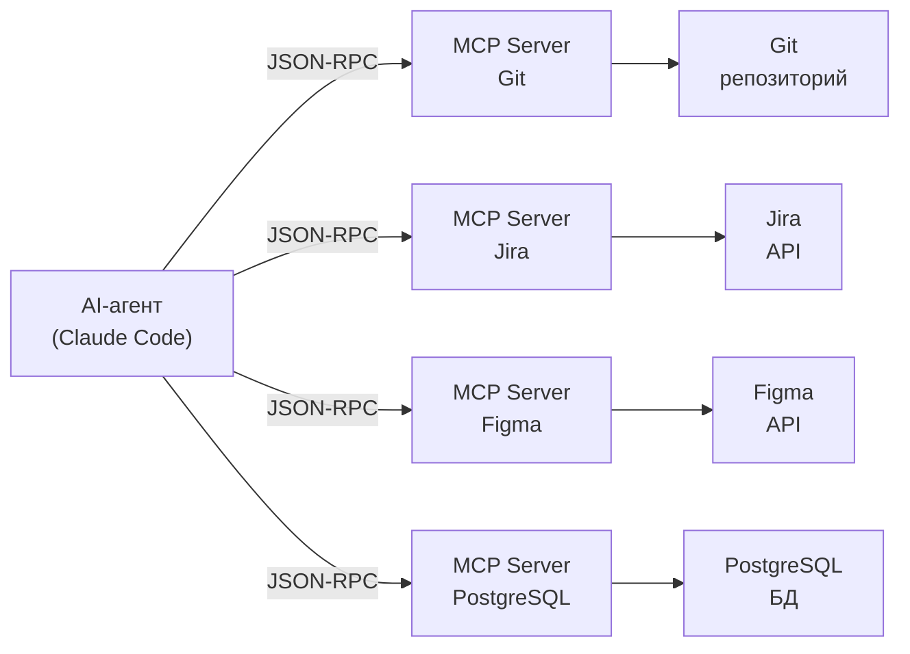

**Где разместить:** `course/module-6-mcp/theory.md`, секция "Архитектура MCP"

---

### V6.2 — Жизненный цикл MCP-вызова

**Что:** Sequence diagram: агент отправляет запрос → MCP-сервер обрабатывает → вызывает внешний инструмент → возвращает результат → агент использует.

**Зачем:** Показать что именно происходит "под капотом" при вызове MCP-инструмента. Убирает магическое восприятие.

**Как выглядит:** Sequence diagram с тремя участниками: Agent, MCP Server, External Tool.

**Формат:** Mermaid sequence diagram

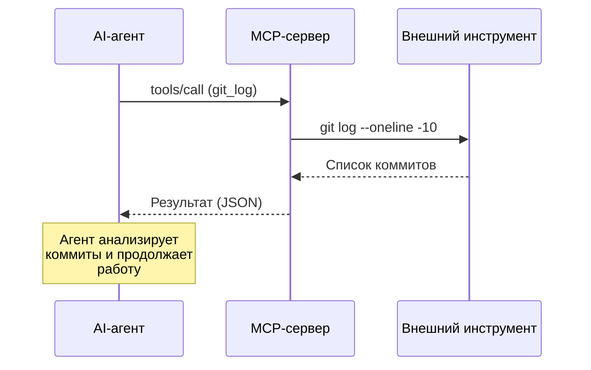

**Где разместить:** `course/module-6-mcp/theory.md`, после описания архитектуры

---

### V6.3 — Карта MCP-серверов по приоритету

**Что:** Группировка MCP-серверов: обязательные (Git, Jira, IDE, Figma) → рекомендуемые (PostgreSQL, Browser) → опциональные (Mermaid, Obsidian, Miro).

**Зачем:** Студент видит с чего начать и в каком порядке расширять набор MCP-серверов.

**Как выглядит:** Три уровня с перечислением серверов.

**Формат:** Mermaid flowchart TD

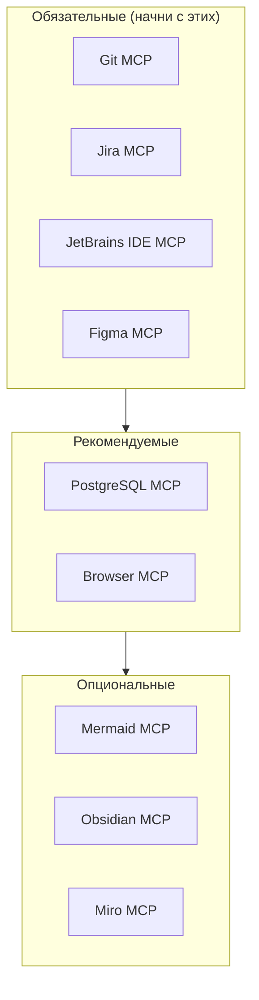

**Где разместить:** `course/module-6-mcp/theory.md`, секция "Категории серверов"

---

## Модуль 7: Параллельные агенты и оркестрация

### V7.1 — Git Worktree: изоляция агентов

**Что:** Схема: один Git-репозиторий → несколько worktree → в каждом свой агент. Показать, что это одна `.git` директория и несколько рабочих копий.

**Зачем:** Рецензия (student-experience-report) прямо просит: "Добавить визуальные примеры git worktree". Концепция worktree непривычна для многих разработчиков.

**Как выглядит:** Центральный блок "Git repo (.git)" и 3 расходящихся блока — worktree с разными задачами.

**Формат:** Mermaid flowchart

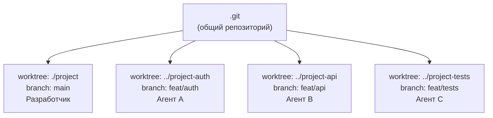

**Где разместить:** `course/module-7-orchestration/theory.md`, секция "Git Worktree"

---

### V7.2 — Ralph Loop (цикл агентной работы)

**Что:** Цикл Do → Check → Fix с условием выхода (все проверки пройдены ИЛИ достигнут лимит итераций).

**Зачем:** Ralph Loop — центральный паттерн модуля. Рецензия рекомендует добавить диаграмму. Текущее текстовое объяснение смешивает Ralph Loop и fail-until-done, студенты путаются.

**Как выглядит:** Цикл с тремя фазами и двумя точками выхода.

**Формат:** Mermaid flowchart

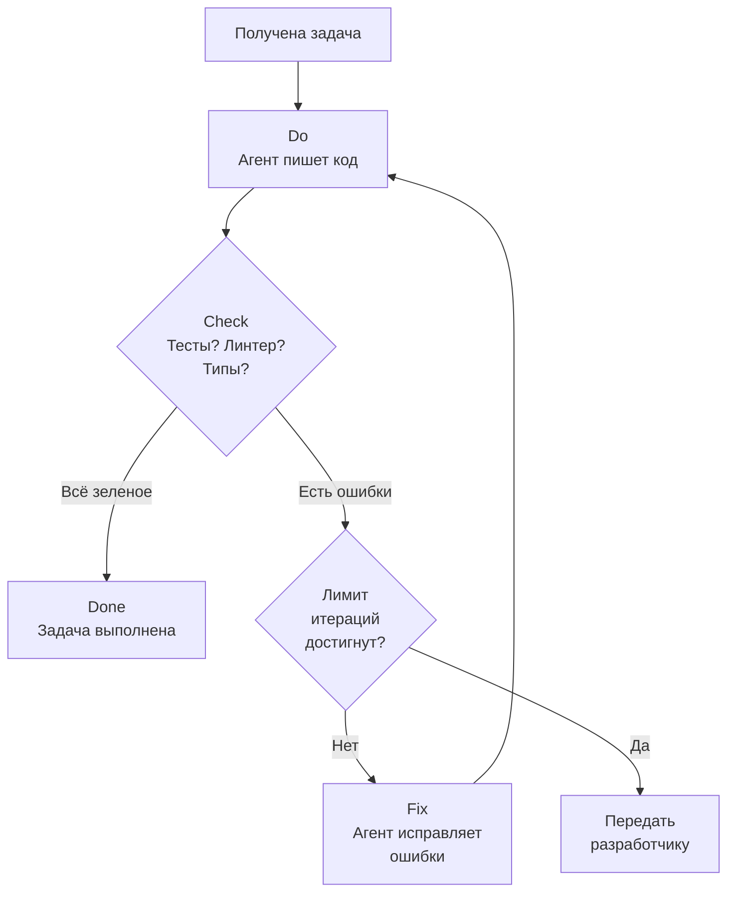

**Где разместить:** `course/module-7-orchestration/theory.md`, секция "Ralph Loop"

---

### V7.3 — Ролевая модель агентов

**Что:** Четыре роли агентов (Architect, Planner, Developer, QA) с указанием модели и типа задач для каждого.

**Зачем:** Показать, что разные агенты используют разные модели для оптимизации стоимости и качества.

**Как выглядит:** Четыре блока с характеристиками, расположенные в порядке workflow.

**Формат:** Mermaid flowchart LR

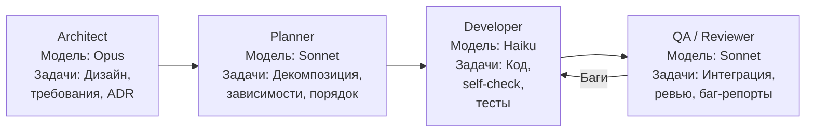

**Где разместить:** `course/module-7-orchestration/theory.md`, секция "Ролевая модель"

---

### V7.4 — Параллельная работа: Terminal Split

**Что:** ASCII-схема split-screen терминала с двумя агентами, работающими параллельно.

**Зачем:** Рецензия (wave4-feedback) рекомендует: "Добавить визуальную схему Terminal A (left) / Terminal B (right)".

**Как выглядит:** ASCII-art двух терминальных окон.

**Формат:** ASCII в code-fence

```
┌─────────────────────────────┬─────────────────────────────┐
│ Terminal A                  │ Terminal B                  │
│ worktree: ../project-auth   │ worktree: ../project-api    │
│ branch: feat/auth           │ branch: feat/api            │
├─────────────────────────────┼─────────────────────────────┤
│ $ claude-code               │ $ claude-code               │
│ > Реализуй аутентификацию   │ > Реализуй REST API для     │
│   по JWT согласно           │   управления пользователями │
│   spec/auth.md              │   согласно spec/users-api.md│
│                             │                             │
│ [Агент работает...]         │ [Агент работает...]         │
│ - Читает спеку              │ - Читает спеку              │
│ - Создает middleware         │ - Создает handlers          │
│ - Пишет тесты               │ - Пишет тесты               │
│ - Запускает проверки        │ - Запускает проверки        │
└─────────────────────────────┴─────────────────────────────┘
```

**Где разместить:** `course/module-7-orchestration/theory.md` или `practice.md`, секция про запуск параллельных агентов

---

## Модуль 8: Ответственная работа с ИИ

### V8.1 — Defence in Depth (слои защиты)

**Что:** Концентрические слои безопасности: .gitignore (внешний) → Agent exclusions → MCP restrictions → Sandboxing → Audit log (внутренний).

**Зачем:** Модель "defence in depth" плохо воспринимается из списка. Визуализация слоёв показывает, что каждый уровень защищает от своего типа угроз.

**Как выглядит:** Вложенные прямоугольники, от внешнего к внутреннему.

**Формат:** Mermaid flowchart TB

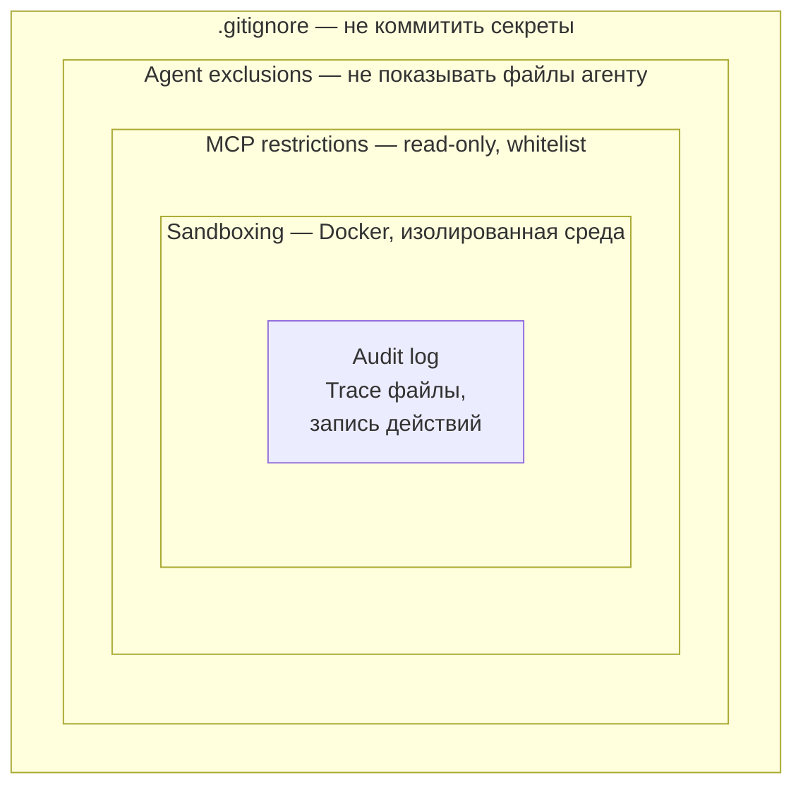

**Где разместить:** `course/module-8-responsibility/theory.md`, секция "Безопасность"

---

### V8.2 — Что нельзя отправлять в ИИ

**Что:** Визуальный список категорий запрещённых данных с примерами и последствиями.

**Зачем:** Критически важная информация, которая должна быть заметной и запоминающейся.

**Как выглядит:** Таблица с колонками: категория, примеры, последствия утечки.

**Формат:** Markdown table

| Категория | Примеры | Последствия |
|-----------|---------|-------------|
| Секреты | API-ключи, токены, пароли, .env | Компрометация системы |
| Персональные данные | Email, телефоны, адреса, медицина | GDPR штраф до 20M EUR |
| Конфиденциальное | NDA-документы, стратегии, IP | Юридические последствия |
| Финансовое | Данные карт, банковские реквизиты | PCI DSS нарушение |

**Где разместить:** `course/module-8-responsibility/theory.md`, секция "Что нельзя отправлять"

---

### V8.3 — Матрица ответственности по уровням

**Что:** Таблица: на каждом уровне зрелости — за что отвечает разработчик.

**Зачем:** Связать модель зрелости из Модуля 1 с ответственностью из Модуля 8. Замыкание курса.

**Формат:** Markdown table

| Уровень | За что отвечаете |
|---------|-----------------|
| 3: Водитель агента | Каждый коммит, каждый файл. Вы нажали "commit" — вы ответственны |
| 4: Специалист | Настройки агента, MCP-конфигурации, правила в AGENTS.md |
| 5: Менеджер оркестра | Вся система: роли, модели, runbook, мониторинг, merge-стратегия |

**Где разместить:** `course/module-8-responsibility/theory.md`, секция "Ответственность"

---

## Сводная таблица всех визуалов

| ID | Модуль | Название | Формат | Приоритет | Сложность |
|----|--------|----------|--------|-----------|-----------|
| V0.1 | 0 | Карта курса | Mermaid | Высокий | Низкая |
| V1.1 | 1 | Модель зрелости (лестница) | Mermaid | Высокий | Низкая |
| V1.2 | 1 | Эволюция разработки | Mermaid | Средний | Низкая |
| V1.3 | 1 | Матрица навыков | Markdown table | Высокий | Средняя |
| V2.1 | 2 | Карта категорий инструментов | Mermaid | Высокий | Средняя |
| V2.2 | 2 | Выбор модели (decision tree) | Mermaid | Высокий | Средняя |
| V2.3 | 2 | Оптимизация затрат | Mermaid | Средний | Низкая |
| V3.1 | 3 | Структура промпта | Mermaid | Высокий | Низкая |
| V3.2 | 3 | Антипаттерны (до/после) | ASCII | Высокий | Низкая |
| V3.3 | 3 | Prompt Chaining | Mermaid | Средний | Низкая |
| V4.1 | 4 | Agent Loop | Mermaid | Высокий | Низкая |
| V4.2 | 4 | Plan vs Act | Mermaid | Средний | Низкая |
| V4.3 | 4 | HITL vs Agentic (уже есть) | Mermaid | — | — |
| V4.4 | 4 | Структура AGENTS.md | Mermaid | Средний | Низкая |
| V5.1 | 5 | SDD-цикл | Mermaid | Высокий | Низкая |
| V5.2 | 5 | Иерархия артефактов | Mermaid | Высокий | Средняя |
| V5.3 | 5 | Progress Table | Markdown table | Средний | Низкая |
| V6.1 | 6 | Архитектура MCP | Mermaid | Высокий | Средняя |
| V6.2 | 6 | Жизненный цикл MCP-вызова | Mermaid sequence | Средний | Средняя |
| V6.3 | 6 | Карта MCP-серверов | Mermaid | Низкий | Низкая |
| V7.1 | 7 | Git Worktree | Mermaid | Высокий | Низкая |
| V7.2 | 7 | Ralph Loop | Mermaid | Высокий | Низкая |
| V7.3 | 7 | Ролевая модель агентов | Mermaid | Средний | Низкая |
| V7.4 | 7 | Terminal Split | ASCII | Средний | Низкая |
| V8.1 | 8 | Defence in Depth | Mermaid | Высокий | Средняя |
| V8.2 | 8 | Запрещённые данные | Markdown table | Высокий | Низкая |
| V8.3 | 8 | Матрица ответственности | Markdown table | Средний | Низкая |

---

## Порядок реализации

### Волна 1 (высокий приоритет — ключевые концепции курса)

1. **V1.1** — Модель зрелости (центральный фреймворк курса)
2. **V4.1** — Agent Loop (базовая концепция агентной работы)
3. **V7.2** — Ralph Loop (центральный паттерн оркестрации)
4. **V5.1** — SDD-цикл (методология spec-driven development)
5. **V6.1** — Архитектура MCP (ключевая схема протокола)
6. **V3.1** — Структура промпта (базовый шаблон для всех промптов)
7. **V0.1** — Карта курса (навигация для студента)
8. **V8.1** — Defence in Depth (безопасность)

### Волна 2 (средний приоритет — поддержка основных концепций)

9. **V1.3** — Матрица навыков
10. **V2.1** — Карта категорий инструментов
11. **V2.2** — Выбор модели
12. **V3.2** — Антипаттерны промптинга
13. **V5.2** — Иерархия артефактов
14. **V7.1** — Git Worktree
15. **V8.2** — Запрещённые данные

### Волна 3 (низкий приоритет — дополнительные визуалы)

16. **V1.2** — Эволюция разработки
17. **V2.3** — Оптимизация затрат
18. **V3.3** — Prompt Chaining
19. **V4.2** — Plan vs Act
20. **V4.4** — Структура AGENTS.md
21. **V5.3** — Progress Table
22. **V6.2** — Жизненный цикл MCP-вызова
23. **V6.3** — Карта MCP-серверов
24. **V7.3** — Ролевая модель агентов
25. **V7.4** — Terminal Split
26. **V8.3** — Матрица ответственности

---

## Техническая реализация

### Mermaid в Markdown

Все Mermaid-диаграммы встраиваются inline в theory.md файлы:

````markdown
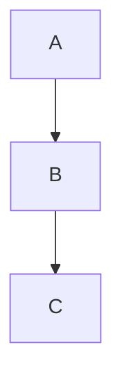
````

Преимущества:
- Версионируется в Git как текст
- Рендерится в GitHub, GitLab, Obsidian, VS Code (с плагином)
- Не требует внешних файлов
- Легко редактируется

### ASCII-схемы

Для простых линейных схем (Terminal Split, сравнение до/после) используются ASCII-блоки в code-fence:

````markdown
```
┌──────────┬──────────┐
│ Левая    │ Правая   │
│ часть    │ часть    │
└──────────┴──────────┘
```
````

### Markdown-таблицы

Для матриц и справочных данных — стандартные Markdown-таблицы. Уже активно используются в курсе, формат знаком.

### Проверка рендеринга

После добавления каждой диаграммы проверить:
1. GitHub preview (основная платформа) — рендерит Mermaid нативно
2. Локально в VS Code с расширением "Markdown Preview Mermaid Support"
3. Fallback: если платформа не поддерживает Mermaid, добавить текстовое описание диаграммы под ней
